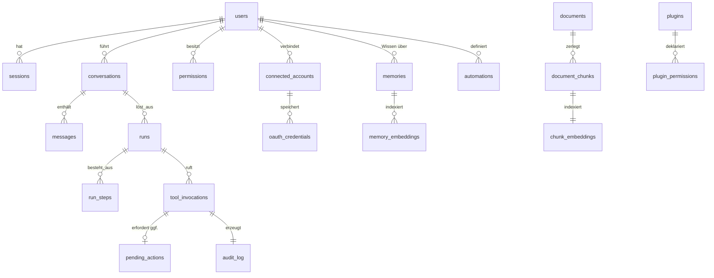

# Datenmodell

PostgreSQL 16 + pgvector. Alle Tabellen mit `id UUID PRIMARY KEY DEFAULT gen_random_uuid()`, `created_at`, `updated_at` (Trigger). Zeitstempel durchgehend `TIMESTAMPTZ` in UTC — lokale Zeitzone ist Präsentationslogik.

---

## 1. Domänenübersicht



---

## 2. Identität, Zugang, Berechtigungen

```sql
CREATE TABLE users (
  id            UUID PRIMARY KEY DEFAULT gen_random_uuid(),
  email         CITEXT UNIQUE NOT NULL,
  display_name  TEXT NOT NULL,
  password_hash TEXT,                      -- Argon2id, optional (Passkey primär)
  locale        TEXT NOT NULL DEFAULT 'de-DE',
  timezone      TEXT NOT NULL DEFAULT 'Europe/Berlin',
  preferences   JSONB NOT NULL DEFAULT '{}',  -- Stimme, Anredeform, Proaktivität
  is_active     BOOLEAN NOT NULL DEFAULT TRUE,
  created_at    TIMESTAMPTZ NOT NULL DEFAULT now()
);

CREATE TABLE webauthn_credentials (
  id            UUID PRIMARY KEY DEFAULT gen_random_uuid(),
  user_id       UUID NOT NULL REFERENCES users(id) ON DELETE CASCADE,
  credential_id BYTEA UNIQUE NOT NULL,
  public_key    BYTEA NOT NULL,
  sign_count    BIGINT NOT NULL DEFAULT 0,
  device_label  TEXT,
  last_used_at  TIMESTAMPTZ
);

-- Scopes sind Daten, keine Enums im Code: neue Tools bringen neue Scopes mit.
CREATE TABLE scopes (
  name          TEXT PRIMARY KEY,          -- 'mail.send', 'calendar.delete'
  description   TEXT NOT NULL,
  default_mode  TEXT NOT NULL              -- 'deny' | 'confirm' | 'allow'
                 CHECK (default_mode IN ('deny','confirm','allow')),
  risk_level    TEXT NOT NULL
                 CHECK (risk_level IN ('low','medium','high','critical'))
);

CREATE TABLE permissions (
  id            UUID PRIMARY KEY DEFAULT gen_random_uuid(),
  user_id       UUID NOT NULL REFERENCES users(id) ON DELETE CASCADE,
  scope         TEXT NOT NULL REFERENCES scopes(name),
  mode          TEXT NOT NULL CHECK (mode IN ('deny','confirm','allow')),
  constraints   JSONB NOT NULL DEFAULT '{}',
  -- Beispiele: {"folders":["~/Dokumente"]}
  --            {"max_amount_eur": 50}
  --            {"recipients_allowlist": ["team@firma.de"]}
  --            {"time_window": {"from":"08:00","to":"20:00"}}
  granted_at    TIMESTAMPTZ NOT NULL DEFAULT now(),
  expires_at    TIMESTAMPTZ,               -- zeitlich befristete Freigaben
  UNIQUE (user_id, scope)
);
```

**Designentscheidung:** `constraints` als JSONB statt weiterer Spalten. Berechtigungseinschränkungen sind je Scope strukturell verschieden (Ordnerliste vs. Betragsgrenze vs. Empfängerliste). Ein normalisiertes Schema dafür wäre entweder eine Key-Value-Tabelle ohne Typsicherheit oder zwanzig Spezialtabellen. Die Validierung erfolgt stattdessen typisiert in Pydantic, je Scope mit eigenem Constraint-Modell — die Typsicherheit sitzt an der Anwendungsgrenze, nicht im DDL.

---

## 3. Verbundene Konten und Secrets

```sql
CREATE TABLE connected_accounts (
  id            UUID PRIMARY KEY DEFAULT gen_random_uuid(),
  user_id       UUID NOT NULL REFERENCES users(id) ON DELETE CASCADE,
  provider      TEXT NOT NULL,             -- 'google' | 'microsoft' | 'home_assistant'
  external_id   TEXT NOT NULL,             -- Konto-ID beim Anbieter
  display_label TEXT NOT NULL,             -- "privat@gmail.com"
  granted_scopes TEXT[] NOT NULL,
  status        TEXT NOT NULL DEFAULT 'active'
                 CHECK (status IN ('active','expired','revoked','error')),
  last_sync_at  TIMESTAMPTZ,
  last_error    TEXT,
  UNIQUE (user_id, provider, external_id)
);

-- Envelope Encryption: kein Klartext-Token in der DB (ADR-008)
CREATE TABLE oauth_credentials (
  id                 UUID PRIMARY KEY DEFAULT gen_random_uuid(),
  account_id         UUID NOT NULL REFERENCES connected_accounts(id) ON DELETE CASCADE,
  ciphertext         BYTEA NOT NULL,       -- AES-256-GCM(access+refresh token)
  nonce              BYTEA NOT NULL,
  wrapped_dek        BYTEA NOT NULL,       -- DEK, verschlüsselt mit KEK
  kek_id             TEXT NOT NULL,        -- ermöglicht KEK-Rotation
  access_expires_at  TIMESTAMPTZ NOT NULL,
  rotated_at         TIMESTAMPTZ NOT NULL DEFAULT now()
);
```

---

## 4. Konversation und Ausführung

```sql
CREATE TABLE conversations (
  id            UUID PRIMARY KEY DEFAULT gen_random_uuid(),
  user_id       UUID NOT NULL REFERENCES users(id) ON DELETE CASCADE,
  title         TEXT,
  channel       TEXT NOT NULL CHECK (channel IN ('voice','text','proactive','automation')),
  summary       TEXT,                      -- rollierende Verdichtung (Working Memory)
  summary_upto  UUID,                      -- bis zu welcher message_id verdichtet
  archived_at   TIMESTAMPTZ
);

CREATE TABLE messages (
  id              UUID PRIMARY KEY DEFAULT gen_random_uuid(),
  conversation_id UUID NOT NULL REFERENCES conversations(id) ON DELETE CASCADE,
  role            TEXT NOT NULL CHECK (role IN ('user','assistant','tool','system')),
  content         TEXT,
  content_parts   JSONB,                   -- multimodal: Bilder, Dateien, Tool-Ergebnisse
  data_class      TEXT NOT NULL DEFAULT 'P1'
                   CHECK (data_class IN ('P0','P1','P2','P3')),
  is_tainted      BOOLEAN NOT NULL DEFAULT FALSE,  -- enthält Fremdinhalt
  token_count     INT,
  model_used      TEXT,
  created_at      TIMESTAMPTZ NOT NULL DEFAULT now()
);
CREATE INDEX ON messages (conversation_id, created_at DESC);
```

`runs` ist das zentrale Ausführungsobjekt — der persistierte Zustand einer Orchestrator-Ausführung. Es macht Läufe pausierbar (Bestätigung ausstehend), wiederaufnehmbar und nachvollziehbar.

```sql
CREATE TABLE runs (
  id              UUID PRIMARY KEY DEFAULT gen_random_uuid(),
  conversation_id UUID REFERENCES conversations(id) ON DELETE CASCADE,
  user_id         UUID NOT NULL REFERENCES users(id) ON DELETE CASCADE,
  trigger         TEXT NOT NULL,           -- 'user' | 'schedule' | 'event' | 'webhook'
  status          TEXT NOT NULL            -- queued|planning|executing|awaiting_confirmation
                   CHECK (status IN ('queued','planning','executing',
                                     'awaiting_confirmation','completed',
                                     'failed','cancelled','budget_exceeded')),
  plan            JSONB,                   -- erzeugter Plan (Schritte)
  state           JSONB NOT NULL DEFAULT '{}',  -- Zwischenzustand für Wiederaufnahme
  taint_level     TEXT NOT NULL DEFAULT 'clean'
                   CHECK (taint_level IN ('clean','tainted')),
  budget          JSONB NOT NULL,          -- {max_tokens, max_steps, max_seconds, max_eur}
  usage           JSONB NOT NULL DEFAULT '{}',
  trace_id        TEXT NOT NULL,           -- OpenTelemetry
  error           JSONB,
  started_at      TIMESTAMPTZ NOT NULL DEFAULT now(),
  finished_at     TIMESTAMPTZ
);
CREATE INDEX ON runs (user_id, started_at DESC);
CREATE INDEX ON runs (status) WHERE status IN ('executing','awaiting_confirmation');

CREATE TABLE run_steps (
  id            UUID PRIMARY KEY DEFAULT gen_random_uuid(),
  run_id        UUID NOT NULL REFERENCES runs(id) ON DELETE CASCADE,
  seq           INT NOT NULL,
  kind          TEXT NOT NULL,             -- 'classify'|'route'|'plan'|'agent'|'tool'|'verify'
  agent_name    TEXT,
  model_used    TEXT,
  input         JSONB,
  output        JSONB,
  tokens_in     INT, tokens_out INT,
  cost_eur      NUMERIC(10,6),
  latency_ms    INT,
  status        TEXT NOT NULL,
  UNIQUE (run_id, seq)
);
```

`run_steps` ist gleichzeitig die Datenquelle für das **Aktivitätsprotokoll** in der UI (Briefing §27). Das Protokoll ist damit eine Projektion echter Ausführung, keine separat geschriebene Log-Zeile, die auseinanderlaufen kann.

---

## 5. Werkzeugausführung, Bestätigungen, Audit

```sql
CREATE TABLE tool_invocations (
  id              UUID PRIMARY KEY DEFAULT gen_random_uuid(),
  run_id          UUID NOT NULL REFERENCES runs(id) ON DELETE CASCADE,
  step_id         UUID REFERENCES run_steps(id) ON DELETE SET NULL,
  tool_name       TEXT NOT NULL,
  arguments       JSONB NOT NULL,          -- validiert gegen ToolSpec
  risk_level      TEXT NOT NULL,
  policy_decision TEXT NOT NULL CHECK (policy_decision IN ('allow','confirm','deny')),
  decision_reason TEXT NOT NULL,           -- warum — für die UI erklärbar
  idempotency_key TEXT UNIQUE,             -- verhindert Doppelausführung
  status          TEXT NOT NULL,           -- pending|approved|rejected|executed|failed|expired
  result          JSONB,
  executed_at     TIMESTAMPTZ
);

CREATE TABLE pending_actions (
  id              UUID PRIMARY KEY DEFAULT gen_random_uuid(),
  invocation_id   UUID NOT NULL UNIQUE REFERENCES tool_invocations(id) ON DELETE CASCADE,
  user_id         UUID NOT NULL REFERENCES users(id) ON DELETE CASCADE,
  preview         JSONB NOT NULL,          -- exakt das, was passieren wird
  nonce           TEXT NOT NULL,           -- gegen gefälschte Bestätigungen
  expires_at      TIMESTAMPTZ NOT NULL,    -- Standard: 10 Minuten
  responded_at    TIMESTAMPTZ,
  response        TEXT CHECK (response IN ('approved','rejected','expired')),
  responded_via   TEXT                     -- 'ui'|'voice'|'gesture'
);
```

**Wichtig zum `preview`-Feld:** Es enthält den validierten, tatsächlich auszuführenden Payload — nicht eine vom Modell formulierte Beschreibung. Die Bestätigungsoberfläche rendert dieses Objekt. Damit ist ausgeschlossen, dass das Modell etwas anderes anzeigt, als es ausführt.

```sql
-- Append-only, hash-verkettet: nachträgliche Manipulation wird erkennbar
CREATE TABLE audit_log (
  id            BIGSERIAL PRIMARY KEY,
  user_id       UUID REFERENCES users(id) ON DELETE SET NULL,
  occurred_at   TIMESTAMPTZ NOT NULL DEFAULT now(),
  actor         TEXT NOT NULL,             -- 'user'|'jarvis'|'scheduler'|'plugin:<name>'
  action        TEXT NOT NULL,             -- 'tool.execute'|'permission.grant'|'memory.delete'
  resource      TEXT,
  details       JSONB NOT NULL DEFAULT '{}',
  trace_id      TEXT,
  prev_hash     BYTEA,
  entry_hash    BYTEA NOT NULL             -- SHA-256(prev_hash || kanonischer Eintrag)
);
REVOKE UPDATE, DELETE ON audit_log FROM PUBLIC;
```

---

## 6. Gedächtnis

```sql
CREATE TYPE memory_kind AS ENUM ('semantic_fact','preference','episodic','entity','procedure');

CREATE TABLE memories (
  id            UUID PRIMARY KEY DEFAULT gen_random_uuid(),
  user_id       UUID NOT NULL REFERENCES users(id) ON DELETE CASCADE,
  kind          memory_kind NOT NULL,
  content       TEXT NOT NULL,             -- ein Fakt pro Datensatz
  structured    JSONB,                     -- optional typisiert (z. B. Kontaktdaten)
  data_class    TEXT NOT NULL DEFAULT 'P2' CHECK (data_class IN ('P0','P1','P2','P3')),

  -- Provenienz: ohne diese Felder wird das Gedächtnis unprüfbar
  source_type   TEXT NOT NULL,             -- 'user_stated'|'inferred'|'imported'|'observed'
  source_ref    JSONB,                     -- {message_id} | {email_id} | {document_id}
  confidence    REAL NOT NULL DEFAULT 1.0 CHECK (confidence BETWEEN 0 AND 1),

  -- Kuratierung: nichts wird blind übernommen
  status        TEXT NOT NULL DEFAULT 'candidate'
                 CHECK (status IN ('candidate','active','superseded','rejected')),
  superseded_by UUID REFERENCES memories(id),

  importance    REAL NOT NULL DEFAULT 0.5,
  access_count  INT NOT NULL DEFAULT 0,
  last_accessed_at TIMESTAMPTZ,
  valid_from    TIMESTAMPTZ NOT NULL DEFAULT now(),
  valid_until   TIMESTAMPTZ,               -- Fakten dürfen ablaufen
  retention_until TIMESTAMPTZ,             -- Aufbewahrungspolitik
  search_tsv    TSVECTOR GENERATED ALWAYS AS (to_tsvector('german', content)) STORED
);
CREATE INDEX ON memories USING GIN (search_tsv);
CREATE INDEX ON memories (user_id, kind, status);
CREATE INDEX ON memories (retention_until) WHERE retention_until IS NOT NULL;

-- Embeddings getrennt: Modellwechsel darf keine Fakten anfassen
CREATE TABLE memory_embeddings (
  memory_id     UUID NOT NULL REFERENCES memories(id) ON DELETE CASCADE,
  model         TEXT NOT NULL,             -- 'bge-m3' | 'text-embedding-3-large'
  dim           INT NOT NULL,
  embedding     VECTOR(1024) NOT NULL,
  PRIMARY KEY (memory_id, model)
);
CREATE INDEX ON memory_embeddings USING hnsw (embedding vector_cosine_ops)
  WITH (m = 16, ef_construction = 64);
```

**Designentscheidung — Embeddings in eigener Tabelle:** Embedding-Modelle wechseln (bessere Modelle, oder ein P3-Datensatz darf nur lokal eingebettet werden). Läge der Vektor in `memories`, hieße jeder Modellwechsel: Schemaänderung plus Neuberechnung aller Zeilen unter Sperren. Getrennt kann ein neues Modell parallel aufgebaut und danach umgeschaltet werden. Der Zusammengesetzte Primärschlüssel `(memory_id, model)` erlaubt beides gleichzeitig.

---

## 7. Dokumente und semantisches Wissen

```sql
CREATE TABLE documents (
  id            UUID PRIMARY KEY DEFAULT gen_random_uuid(),
  user_id       UUID NOT NULL REFERENCES users(id) ON DELETE CASCADE,
  source        TEXT NOT NULL,             -- 'upload'|'gmail'|'filesystem'|'web'
  source_ref    TEXT,
  title         TEXT NOT NULL,
  mime_type     TEXT NOT NULL,
  storage_path  TEXT NOT NULL,
  content_hash  BYTEA NOT NULL,            -- Deduplizierung
  data_class    TEXT NOT NULL DEFAULT 'P2',
  is_untrusted  BOOLEAN NOT NULL DEFAULT TRUE,  -- Fremdinhalt → Taint bei Nutzung
  indexed_at    TIMESTAMPTZ,
  UNIQUE (user_id, content_hash)
);

CREATE TABLE document_chunks (
  id            UUID PRIMARY KEY DEFAULT gen_random_uuid(),
  document_id   UUID NOT NULL REFERENCES documents(id) ON DELETE CASCADE,
  seq           INT NOT NULL,
  content       TEXT NOT NULL,
  heading_path  TEXT[],                    -- Kapitelpfad für Kontext beim Retrieval
  page          INT,
  token_count   INT NOT NULL,
  search_tsv    TSVECTOR GENERATED ALWAYS AS (to_tsvector('german', content)) STORED,
  UNIQUE (document_id, seq)
);
CREATE INDEX ON document_chunks USING GIN (search_tsv);

CREATE TABLE chunk_embeddings (
  chunk_id      UUID NOT NULL REFERENCES document_chunks(id) ON DELETE CASCADE,
  model         TEXT NOT NULL,
  embedding     VECTOR(1024) NOT NULL,
  PRIMARY KEY (chunk_id, model)
);
CREATE INDEX ON chunk_embeddings USING hnsw (embedding vector_cosine_ops);
```

---

## 8. Aufgaben, Erinnerungen, Automationen

```sql
CREATE TABLE tasks (
  id            UUID PRIMARY KEY DEFAULT gen_random_uuid(),
  user_id       UUID NOT NULL REFERENCES users(id) ON DELETE CASCADE,
  title         TEXT NOT NULL,
  notes         TEXT,
  status        TEXT NOT NULL DEFAULT 'open'
                 CHECK (status IN ('open','in_progress','done','cancelled')),
  priority      INT NOT NULL DEFAULT 3 CHECK (priority BETWEEN 1 AND 5),
  due_at        TIMESTAMPTZ,
  project       TEXT,
  external_ref  JSONB                      -- Sync mit Todoist/Notion (Plugin)
);

CREATE TABLE automations (
  id            UUID PRIMARY KEY DEFAULT gen_random_uuid(),
  user_id       UUID NOT NULL REFERENCES users(id) ON DELETE CASCADE,
  name          TEXT NOT NULL,
  enabled       BOOLEAN NOT NULL DEFAULT TRUE,
  trigger_type  TEXT NOT NULL
                 CHECK (trigger_type IN ('cron','once','calendar_event',
                                         'email_match','webhook','state_change')),
  trigger_config JSONB NOT NULL,           -- {"cron":"0 9 * * 1","tz":"Europe/Berlin"}
  condition     JSONB,                     -- optionale Vorbedingung
  action        JSONB NOT NULL,            -- {"kind":"prompt","text":"…"} | {"kind":"tool",…}
  -- Automationen erben NICHT automatisch alle Rechte des Nutzers:
  allowed_scopes TEXT[] NOT NULL DEFAULT '{}',
  requires_confirmation BOOLEAN NOT NULL DEFAULT TRUE,
  last_fired_at TIMESTAMPTZ,
  next_fire_at  TIMESTAMPTZ
);
CREATE INDEX ON automations (next_fire_at) WHERE enabled;
```

**Wichtig:** `allowed_scopes` auf der Automation. Eine nachts laufende Automation ohne anwesenden Nutzer darf nicht dieselben Rechte haben wie ein interaktiver Dialog — sonst gibt es keine Bestätigungsinstanz. Standard ist `requires_confirmation = TRUE`, die Aktion wartet dann in `pending_actions` auf dich.

---

## 9. Plugins und Systemzustand

```sql
CREATE TABLE plugins (
  id            UUID PRIMARY KEY DEFAULT gen_random_uuid(),
  name          TEXT UNIQUE NOT NULL,
  version       TEXT NOT NULL,
  manifest      JSONB NOT NULL,
  enabled       BOOLEAN NOT NULL DEFAULT FALSE,   -- Opt-in, nie automatisch aktiv
  installed_at  TIMESTAMPTZ NOT NULL DEFAULT now(),
  source        TEXT NOT NULL                     -- 'local'|'registry'|'mcp'
);

CREATE TABLE plugin_permissions (
  plugin_id     UUID NOT NULL REFERENCES plugins(id) ON DELETE CASCADE,
  scope         TEXT NOT NULL REFERENCES scopes(name),
  granted       BOOLEAN NOT NULL DEFAULT FALSE,
  PRIMARY KEY (plugin_id, scope)
);

CREATE TABLE system_health (
  component     TEXT PRIMARY KEY,          -- 'llm.openai'|'mail.gmail'|'edge.audio'
  status        TEXT NOT NULL CHECK (status IN ('ok','degraded','down','unknown')),
  latency_ms    INT,
  detail        JSONB,
  checked_at    TIMESTAMPTZ NOT NULL DEFAULT now()
);
```

---

## 10. Aufbewahrung und Löschung

Ein nächtlicher Job setzt die Aufbewahrungspolitik durch:

| Daten | Standard-Aufbewahrung | Konfigurierbar |
|---|---|---|
| Audio-Rohdaten | **wird nie persistiert** (nur Ringpuffer im RAM) | nein |
| Transkripte | 90 Tage | ja |
| Nachrichten / Konversationen | unbegrenzt, archivierbar | ja |
| `run_steps` (Aktivitätsprotokoll) | 180 Tage | ja |
| `audit_log` | 2 Jahre, unveränderlich | nur verlängerbar |
| Memories | unbegrenzt bis Löschung durch Nutzer | pro Eintrag `retention_until` |
| Dokumente + Chunks | bis Löschung | ja |
| Kamera-Frames | **wird nie persistiert** | nein |

**Vollständige Löschung** (`DELETE /v1/me/data`) läuft in einer Transaktion über alle `ON DELETE CASCADE`-Ketten. Genau dies ist der praktische Grund für ADR-003 (eine Datenbank): Ein Löschauftrag, der über zwei Systeme laufen müsste, ist ein Auftrag, der irgendwann unvollständig bleibt.

Der `audit_log` ist bewusst ausgenommen und wird stattdessen pseudonymisiert (`user_id → NULL`), damit die Hash-Kette intakt bleibt.
