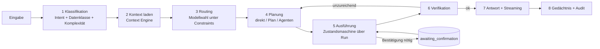
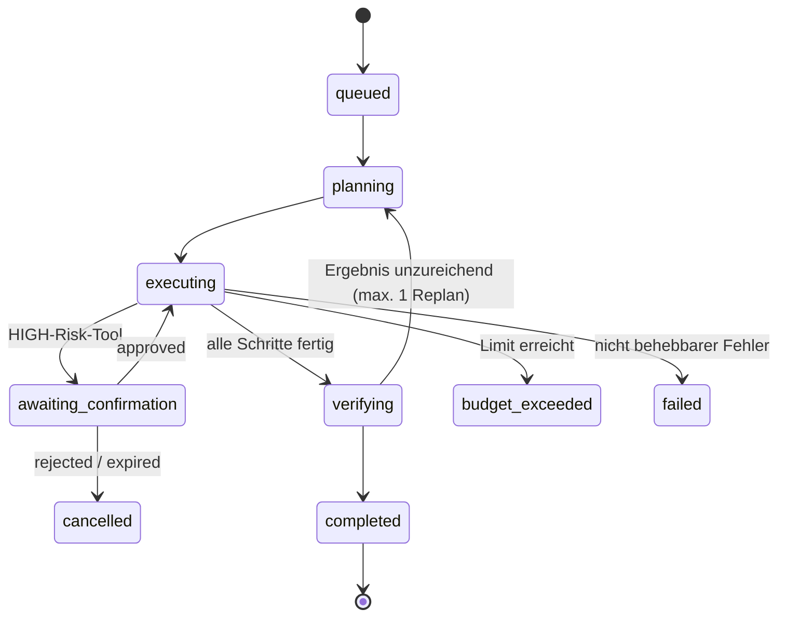

# AI Orchestrator

Der Orchestrator ist die einzige Komponente, die entscheidet **was passiert**. Alles andere führt aus. Er ist bewusst schlank gehalten: Klassifizieren, Routen, Planen, Ausführen, Verifizieren, Budgetieren.

---

## 1. Pipeline



---

## 2. Stufe 1 — Klassifikation

Ein einziger, günstiger Aufruf (lokales Modell oder kleines Cloud-Modell) erzeugt ein typisiertes Objekt:

```python
class TurnClassification(BaseModel):
    intent: Literal[
        "chat", "question", "task", "command", "research", "creative", "code", "clarification"
    ]
    complexity: Literal["trivial", "simple", "moderate", "complex"]
    data_class: DataClass  # P0 … P3
    required_capabilities: list[Capability]  # tool_calling, vision, long_context, …
    likely_tools: list[str]
    needs_realtime_info: bool
    is_multi_step: bool
    explicit_model_request: str | None  # "nutze Claude" → überschreibt Routing
    ambiguous_references: list[str]  # ["ihm", "das Dokument"]
    confidence: float
```

**Warum nicht das große Modell selbst entscheiden lassen?** Drei Gründe: (a) Kosten — die Klassifikation läuft bei jedem Turn; (b) Latenz — ein lokales 8B-Modell liefert das in 80–150 ms; (c) Prüfbarkeit — die Klassifikation ist ein Datensatz, gegen den sich eine Eval-Suite fahren lässt (`15-testing.md`).

**Trivialfall-Abkürzung:** Vorgeschaltete deterministische Regeln fangen die häufigsten Fälle ohne jeden Modellaufruf ab — „wie spät ist es", „stopp", „lauter", Wake-Word-Nachlauf ohne Inhalt. Das spart bei Sprachbedienung spürbar Latenz.

---

## 3. Stufe 3 — Routing

Der Router ist **kein LLM**, sondern eine deterministische Funktion über der Klassifikation. Das ist wichtig: eine Modellwahl, die selbst von einem Modell getroffen wird, ist weder reproduzierbar noch testbar noch gegen Prompt Injection abgesichert.

```python
def route(c: TurnClassification, prefs: UserPrefs, health: HealthSnapshot) -> RoutingDecision:
    # 1) Ausdrücklicher Nutzerwunsch gewinnt — sofern zulässig
    if c.explicit_model_request:
        cand = resolve(c.explicit_model_request)
        if policy_allows(cand, c.data_class):
            return RoutingDecision(cand, reason="explizit angefordert")
        return RoutingDecision(local_model(), reason="angefordertes Modell für P3 gesperrt")

    # 2) Datenklassifikation ist ein HARTES Filter, keine Präferenz
    candidates = [
        m
        for m in registry.all()
        if m.max_data_class >= c.data_class
        and m.supports(c.required_capabilities)
        and health.is_up(m.provider)
    ]

    if not candidates:
        return RoutingDecision(local_model(), reason="Fallback: kein Kandidat verfügbar")

    # 3) Gewichtung: Eignung · Latenz · Kosten
    return max(candidates, key=lambda m: score(m, c, prefs))
```

### Routing-Matrix (Startwerte, per Konfiguration änderbar)

| Situation | Bevorzugt | Begründung |
|---|---|---|
| P3-Daten (Gesundheit, Finanzen, Zugangsdaten) | **Lokal, ausnahmslos** | Hartes Filter |
| Sprachdialog, kurze Antwort | Schnelles Cloud-Modell mittlerer Größe | Latenz dominiert |
| Lange Dokumente, Analyse, strukturierte Wissensarbeit | Claude | Langkontext-Verhalten, Zitatgenauigkeit |
| Mehrschrittige Planung mit vielen Tools | Frontier-Modell mit starkem Tool-Calling | Zuverlässigkeit der Argumentstruktur |
| Multimodal (Bild + Text) | Modell mit Vision-Capability | Fähigkeitsfilter |
| Websuche, aktuelle Fakten | Modell mit Suchanbindung + eigener Fetcher | Quellenpflicht |
| Klassifikation, Extraktion, Zusammenfassung | Lokal | Volumen, Kosten, Datenschutz |
| Offline | Lokal | Einziger Kandidat |

**Transparenz:** Jede `RoutingDecision` trägt ein `reason`-Feld, das in der UI angezeigt wird (Briefing §2: „Zeige transparent an, welches Modell verwendet wird" — inklusive *warum*).

**Failover:** Fällt ein Provider während der Ausführung aus, wiederholt der Executor den Schritt mit dem nächstbesten Kandidaten derselben Klassifikationsstufe. Der Wechsel wird als `run_step` protokolliert und in der UI sichtbar gemacht — kein stiller Providerwechsel.

---

## 4. Datenklassifikation als hartes Filter

Das ist der Punkt, an dem sich dieses System von einem üblichen „LLM-Router" unterscheidet. Ein Modell wird **nie** gewählt, weil es besser ist, wenn es für die Datenklasse nicht zugelassen ist.

```python
class ModelCapability(BaseModel):
    name: str
    provider: str
    max_data_class: DataClass  # P0..P3 — höchste zulässige Stufe
    context_window: int
    supports_tools: bool
    supports_vision: bool
    cost_per_1m_in: Decimal
    cost_per_1m_out: Decimal
    p50_latency_ms: int
    zero_retention: bool  # vertraglich zugesichert?
```

`max_data_class` wird pro Deployment konfiguriert, nicht vom Modell behauptet. Ein Cloud-Modell erhält `P1` als Standard und nur nach ausdrücklicher Freigabe `P2`. `P3` ist strukturell lokalen Modellen vorbehalten.

---

## 5. Stufe 4 — Planung

Drei Ausführungsmodi, gewählt anhand der Klassifikation:

| Modus | Wann | Ablauf |
|---|---|---|
| **Direct** | `complexity ∈ {trivial, simple}`, keine oder ein Tool | Ein Modellaufruf mit Tool-Schleife, max. 3 Iterationen |
| **Planned** | `is_multi_step`, 2–6 Schritte | Explizite Planerzeugung → schrittweise Ausführung → Verifikation |
| **Delegated** | Spezialistenwissen nötig oder > 6 Schritte | Supervisor delegiert an Sub-Agenten (`06-agenten-tools.md`) |

Der Plan ist ein validiertes Objekt, kein Freitext:

```python
class Plan(BaseModel):
    goal: str
    steps: list[PlanStep]
    estimated_tokens: int
    requires_confirmation: bool  # ergibt sich aus max(risk) der Schritte
    fallback: str | None  # was tun, wenn Schritt N scheitert


class PlanStep(BaseModel):
    seq: int
    description: str  # für die UI, in natürlicher Sprache
    kind: Literal["tool", "agent", "llm", "confirm"]
    target: str
    depends_on: list[int] = []  # ermöglicht parallele Ausführung
    optional: bool = False  # Scheitern bricht den Lauf nicht ab
```

Der Plan wird der UI **vor** der Ausführung gezeigt. Das ist kein Kosmetik-Feature: bei einem System mit Mail- und Kalenderzugriff ist die frühe Sichtbarkeit der Absicht die wirksamste Fehlerbremse.

`depends_on` erlaubt echte Parallelität — „prüfe Mails" und „prüfe Kalender" laufen gleichzeitig, was in typischen Abläufen 1–3 Sekunden spart.

---

## 6. Stufe 5 — Ausführung als Zustandsmaschine



Der Zustand liegt vollständig in `runs.state` (JSONB). Daraus folgen drei Eigenschaften, die ein rein im Speicher gehaltener Agentenloop nicht hat:

1. **Pausierbarkeit über Prozessgrenzen.** Eine Bestätigung darf Stunden dauern; der API-Prozess darf zwischendurch neu starten.
2. **Wiederaufnahme nach Absturz.** Ein Worker-Neustart nimmt `executing`-Läufe wieder auf.
3. **Kanalunabhängigkeit.** Der Lauf startet per Sprache und wird per Klick in der UI bestätigt — dasselbe Objekt.

Genau diese Form ist es, die einen späteren Wechsel auf Temporal (ADR-002) zu einem Executor-Tausch macht statt zu einer Neuentwicklung.

---

## 7. Budgets und Kostenkontrolle

Jeder Lauf startet mit einem Budget. Überschreitung beendet den Lauf sauber mit Teilergebnis, statt weiterzulaufen.

```python
class RunBudget(BaseModel):
    max_tokens: int = 120_000
    max_steps: int = 20
    max_seconds: int = 120
    max_cost_eur: Decimal = Decimal("0.50")
    max_tool_calls: int = 15
    max_agent_depth: int = 2  # verhindert Agenten-Rekursion
```

Standardwerte je Auslöser:

| Auslöser | Tokens | Zeit | Kosten | Begründung |
|---|---|---|---|---|
| Sprachdialog | 20k | 20 s | 0,05 € | Latenz ist das Budget |
| Text-Chat | 120k | 120 s | 0,50 € | Nutzer wartet bewusst |
| Recherche-Auftrag | 400k | 600 s | 2,00 € | ausdrücklich angestoßen |
| Automation / nachts | 60k | 300 s | 0,20 € | niemand beaufsichtigt |

Zusätzlich ein **Tagesbudget pro Nutzer**. Bei 80 % Warnung in der UI, bei 100 % nur noch lokale Modelle. Ohne diese Grenze ist eine fehlerhafte Agentenschleife ein finanzielles Risiko, kein Bug.

**Stand 25.08.2026.** Das Laufbudget greift, und seit `models.py`/`gateway.py` Preise führen, greift auch die Kostengrenze: Der Katalogeintrag kennt `cost_per_1m_in`, `cost_per_1m_out` und optional `cost_per_1m_cached_in`, das Model Gateway rechnet nach jedem Aufruf und schreibt das Ergebnis in `ModelUsage.cost_eur`, der `BudgetTracker` summiert. Davor war die Kostengrenze eine Statistik — der Zähler zählte, und er zählte immer null.

Zwei Festlegungen dazu:

- **Ohne Preis kein Aufruf.** Ein Modell eines fremden Anbieters ohne hinterlegten Preis steht nicht im Katalog, und das Gateway weist es zusätzlich ab (`model-has-no-price`). Für lokale Modelle gilt das nicht: Sie kosten Strom, keine Rechnung, und ein erfundener Preis machte das Budget unschärfer statt ehrlicher.
- **Die Preise stehen in der Konfiguration**, nicht im Quelltext — eine Preisliste im Repository ist beim nächsten Anbieterrundbrief falsch, und niemand merkt es. Der Katalog beschreibt das Deployment; er ruft keine Preisliste ab.

**Das Tagesbudget greift seit dem 25.08.2026.** `JARVIS_DAILY_BUDGET_EUR` wird jetzt gelesen (Vorgabe 5,00 €, kein Ausschalter — ein Wert von null hieße „keine Grenze" und sähe aus wie „nicht konfiguriert").

- **Gezählt wird über die Läufe**, nicht in einem eigenen Hauptbuch: Der Verbrauch steht bereits in `runs.usage`, überlebt einen Neustart und wird nach jedem Schritt fortgeschrieben. Eine zweite Tabelle wäre eine zweite Wahrheit über denselben Sachverhalt. Der Preis dieser Wahl ist benannt: Ein Lauf zählt zu dem Tag, an dem er **begonnen** hat.
- **Welcher Tag gemeint ist, steht in der Konfiguration** (`JARVIS_TIMEZONE`, Vorgabe `Europe/Berlin`). Der UTC-Tag wäre bequem und falsch — er setzte das Budget im Sommer um 02:00 Ortszeit zurück.
- **Gerechnet wird mit dem Zugesagten, nicht mit dem Verbuchten.** Ein laufender Lauf zählt mit seinem `max_cost_eur`, nicht mit dem, was er bisher ausgegeben hat. Ohne das war die Grenze weich: Bei 4,99 € von 5,00 € durfte jeder weitere Lauf in die Wolke, und zehn davon gaben zehn Budgets aus. Was bleibt, ist ein Wettlauf von der Breite eines Requests — zwei gleichzeitige Anlagen lesen denselben Stand; das ließe sich mit einer Sperre je Nutzer schließen und ist heute genannt statt behauptet.
- **Die Wirkung ist eine Verengung, kein Abbruch.** Ein Lauf, der sein eigenes Budget reißt, endet; beim Tagesbudget wäre das falsch. Es soll nicht der Assistent ausfallen, sondern der teure Weg. `route(..., local_only=True)` filtert deshalb hart auf lokale Modelle — bei den Filtern und nicht bei den Gewichten: `prefer_local` gibt einen Bonus, den ein besseres Modell überbietet, und eine Kostengrenze, die bei genügend Qualitätsvorsprung nachgibt, ist keine.
- **Geprüft wird beim Anlegen eines Laufs**, nicht vor jedem Modellaufruf. Die mögliche Überschreitung ist damit um **ein Laufbudget** begrenzt. Eine Prüfung mitten im Lauf hieße, die Modellwahl eines laufenden Auftrags zu ändern — und damit die Datenklassen-Obergrenze zu verschieben, unter der er gestartet ist.
- **Sichtbar, bevor es wirkt:** `GET /budget` liefert Stand, Grenze, Tagesbeginn, Anteil, Warnung und Erschöpfung; die Leiste der Oberfläche zeigt ab 80 % eine Marke und darunter nichts. Eine Leiste, die dauerhaft einen Kontostand zeigt, macht aus einer Warnung eine Tapete. Einen **Schreibweg gibt es nicht**: Ein Endpunkt, über den sich das eigene Limit anheben ließe, wäre kein Limit, sondern eine Bitte.

Dabei fiel auf, dass `RoutingDecision.reason` seit dem ersten Entwurf für die Oberfläche gedacht war und nie jemand las. `GET /runs/{id}` führt jetzt `model` und `model_reason` — ohne sie sähe ein Nutzer bei erschöpftem Budget eine schlechtere Antwort und keinen Grund.

---

## 8. Stufe 6 — Verifikation

Nicht jedes Ergebnis wird geprüft — das würde Kosten und Latenz verdoppeln. Verifikation läuft nur bei:

- Läufen mit ≥ 3 Schritten,
- Ergebnissen, die in eine Aktion mit Außenwirkung münden,
- Rechercheergebnissen (Quellenprüfung: existiert die zitierte Quelle, stützt sie die Aussage?).

Die Prüfung fragt eng: *Beantwortet das Ergebnis die gestellte Frage? Sind alle Planschritte erfüllt? Gibt es unbelegte Faktenbehauptungen?* Bei negativem Befund genau **ein** Replan-Versuch — mehr führt erfahrungsgemäß zu Schleifen ohne Qualitätsgewinn.

---

## 9. Fehlerbehandlung (Briefing §28)

```python
ERROR_POLICY = {
    RateLimitError: Retry(backoff="exponential", max=3, then="switch_provider"),
    ProviderDownError: SwitchProvider(then="local_model"),
    TimeoutError: Retry(max=1, then="partial_result"),
    AuthExpiredError: NotifyUser("Zugang zu {provider} abgelaufen — neu verbinden?"),
    ToolValidationError: Reprompt(max=2, then="ask_user"),
    PermissionDenied: ExplainAndOffer("Ich darf {scope} nicht. Freigabe erteilen?"),
    NoInternet: Degrade(to="local_model", inform=True),
    BudgetExceeded: PartialResult(explain=True),
}
```

**Grundregel:** Fehler werden benannt, nicht kaschiert. Wenn der Kalender nicht erreichbar ist, sagt JARVIS das — er rät nicht, wie der Tag aussehen könnte. Ein Assistent, der bei Ausfall plausibel klingende Erfindungen liefert, ist schlimmer als einer, der schweigt.

---

## 10. Streaming-Protokoll

Antworten streamen ab dem ersten Token. Der Orchestrator sendet über WebSocket (Details in `11-api.md`):

```
run.started       { run_id, trace_id }
run.classified    { intent, data_class, complexity }
run.routed        { model, provider, reason }        → UI zeigt Modellwechsel
run.plan          { steps[] }                         → UI zeigt Plan
step.started      { seq, description }                → Aktivitätsprotokoll
step.finished     { seq, status, latency_ms }
token.delta       { text }                            → Chat + TTS-Puffer
action.pending    { action_id, preview, expires_at }  → Bestätigungsdialog
run.finished      { status, usage, cost_eur }
run.error         { code, message, recoverable }
```

`token.delta` speist gleichzeitig die Textausgabe und den TTS-Puffer. Der TTS-Client synthetisiert satzweise, sobald ein Satzende erkannt wird — das reduziert die wahrgenommene Antwortzeit erheblich (siehe `08-voice.md §6`).
