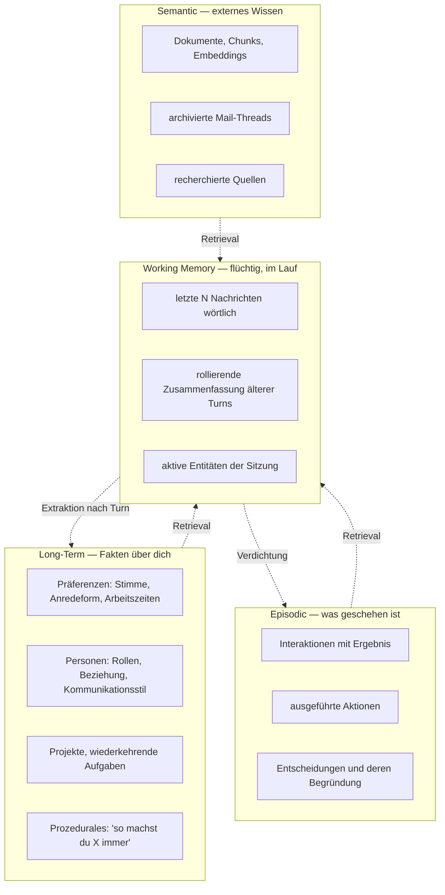
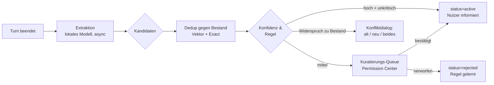
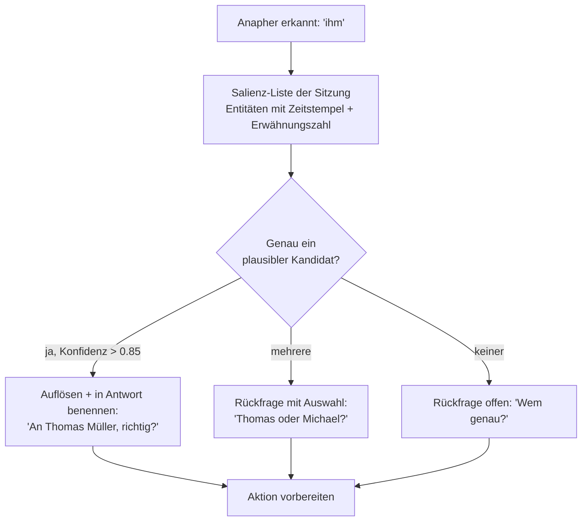

# Memory- und Context-Architektur

Zwei getrennte Komponenten, die häufig verwechselt werden:

- **Memory** ist der *Speicher* — was dauerhaft über dich bekannt ist.
- **Context Engine** ist der *Auswahlmechanismus* — was davon in diesem Moment relevant ist.

Memory beantwortet „was weiß ich?", Context Engine beantwortet „was gehört jetzt ins Prompt?". Die zweite Frage ist die schwierigere.

---

## 1. Die vier Gedächtnisebenen



| Ebene | Speicherort | Lebensdauer | Zugriff |
|---|---|---|---|
| Working | `conversations.summary` + letzte `messages` | Sitzung | direkt geladen |
| Long-Term | `memories` (`preference`, `entity`, `procedure`) | dauerhaft bis Löschung | Retrieval + immer geladene Kernpräferenzen |
| Episodic | `memories` (`episodic`) + `runs` | 1–2 Jahre, konfigurierbar | Retrieval |
| Semantic | `documents` / `document_chunks` | bis Löschung | Retrieval |

---

## 2. Working Memory: Verdichtung statt Abschneiden

Naives Abschneiden („letzte 20 Nachrichten") verliert genau die Information, die einen Dialog kohärent macht — was am Anfang vereinbart wurde. Stattdessen ein zweiteiliger Puffer:

```
[ Kernpräferenzen        ]  immer geladen, ~300 Token, aus Long-Term
[ Rollierende Summary    ]  Turns 1..n-k, ~500 Token, lokal erzeugt
[ Letzte k Turns wörtlich]  k dynamisch nach Tokenbudget
```

Die Verdichtung läuft **asynchron nach** dem Turn (lokales Modell, kostenlos, außerhalb des Latenzpfads) und schreibt nach `conversations.summary` / `summary_upto`. Sie blockiert nie eine Antwort.

---

## 3. Gedächtnisbildung: Kandidaten statt Direktschreiben

Das Briefing ist hier eindeutig („nicht einfach ungefiltert speichern") — und der Punkt ist wichtiger, als er klingt. Ein Assistent, der aus einem beiläufigen Satz einen dauerhaften „Fakt" macht, wird über Monate zunehmend falsch und die Fehler sind schwer aufzuspüren.



**Automatisch übernommen** werden nur ausdrückliche Aussagen mit hoher Konfidenz und niedrigem Risiko („Nenn mich Mirek", „Ich arbeite ab 8 Uhr"). Abgeleitete Schlüsse („scheint Meetings vormittags zu bevorzugen") gehen in die Queue.

**Widersprüche** löschen nichts. Der alte Eintrag wird `superseded` mit `superseded_by`-Verweis — damit bleibt nachvollziehbar, was JARVIS wann glaubte. Für Debugging von Fehlverhalten ist das unverzichtbar.

**Jeder Eintrag trägt Provenienz** (`source_type`, `source_ref`, `confidence`). Auf die Frage „woher weißt du das?" kann JARVIS die konkrete Nachricht oder Mail benennen. Ohne dieses Feld ist ein Langzeitgedächtnis nicht auditierbar.

---

## 4. Retrieval: hybrid und gewichtet

Reine Vektorsuche versagt an Eigennamen und exakten Bezeichnern (Projektnummern, Aktenzeichen, Personennamen). Reine Volltextsuche versagt an Umschreibungen. Also beides, in einer Query:

```sql
WITH vec AS (
  SELECT m.id, 1 - (e.embedding <=> $query_vec) AS score
  FROM memories m JOIN memory_embeddings e ON e.memory_id = m.id
  WHERE m.user_id = $uid AND m.status = 'active' AND e.model = $model
    AND m.data_class <= $max_class
  ORDER BY e.embedding <=> $query_vec LIMIT 50
),
kw AS (
  SELECT m.id, ts_rank_cd(m.search_tsv, plainto_tsquery('german', $q)) AS score
  FROM memories m
  WHERE m.user_id = $uid AND m.status = 'active'
    AND m.search_tsv @@ plainto_tsquery('german', $q)
  ORDER BY score DESC LIMIT 50
)
SELECT m.*,
       0.55 * COALESCE(v.score, 0)
     + 0.25 * COALESCE(k.score, 0)
     + 0.10 * exp(-EXTRACT(EPOCH FROM now() - m.valid_from) / 2592000.0)  -- 30d Halbwert
     + 0.10 * m.importance
     AS final_score
FROM memories m
LEFT JOIN vec v ON v.id = m.id
LEFT JOIN kw  k ON k.id = m.id
WHERE (v.id IS NOT NULL OR k.id IS NOT NULL)
  AND (m.valid_until IS NULL OR m.valid_until > now())
ORDER BY final_score DESC
LIMIT $k;
```

Die vier Gewichte (Semantik, Stichwort, Aktualität, Wichtigkeit) sind konfigurierbar und werden gegen eine Eval-Suite kalibriert (`15-testing.md §4`) — nicht nach Gefühl gesetzt.

**Der `data_class`-Filter in der Vektor-CTE ist sicherheitsrelevant:** Wenn der aktuelle Turn an ein Cloud-Modell geht, dürfen P3-Erinnerungen gar nicht erst in die Ergebnismenge gelangen. Der Filter sitzt in der Datenbank, nicht in der Anwendungsschicht — dort würde er irgendwann vergessen.

---

## 5. Context Engine

Kontext wird von registrierten Providern erzeugt, jeder mit eigenem Token-Budget und eigener Kostenklasse:

```python
class ContextProvider(Protocol):
    name: str
    cost: Literal["free", "db", "network"]  # steuert, ob im Latenzpfad zulässig

    async def provide(self, req: ContextRequest) -> ContextFragment | None: ...


class ContextFragment(BaseModel):
    source: str
    content: str
    tokens: int
    relevance: float
    data_class: DataClass
    is_untrusted: bool = False  # ⬅ löst Taint aus (siehe 07-security §4)
```

Registrierte Provider:

| Provider | Kosten | Liefert |
|---|---|---|
| `time` | free | Datum, Uhrzeit, Wochentag, Zeitzone |
| `user_profile` | free | Kernpräferenzen (immer geladen) |
| `conversation` | free | Working Memory |
| `calendar_today` | db | Termine heute/morgen (gecacht, 5 min) |
| `tasks_open` | db | offene Aufgaben nach Priorität |
| `memory_relevant` | db | Top-k Retrieval zur Anfrage |
| `recent_actions` | db | letzte Aktionen (für „mach das rückgängig") |
| `active_project` | db | aktuell erkannter Arbeitskontext |
| `location` | free | Standort, sofern freigegeben |
| `weather` | network | nur bei erkanntem Bedarf |
| `documents` | db | RAG-Chunks bei Dokumentbezug |

### Budgetierung

```python
CONTEXT_BUDGET = {
    "voice": 4_000,  # Latenz dominiert
    "text": 16_000,
    "agent": 32_000,
}
```

Bei Überschreitung greift eine feste Verdrängungsreihenfolge — nicht „was zuletzt kam, fliegt raus":

```
1. Kernpräferenzen        nie verdrängt
2. Aktuelle Nachricht     nie verdrängt
3. Working Memory         auf Summary reduzierbar
4. Retrieval-Ergebnisse   k wird reduziert
5. Kalender/Tasks         auf Zusammenfassung reduzierbar
6. Optionale Provider     zuerst entfernt
```

---

## 6. Referenzauflösung (Briefing §25)

*„Schreib ihm, dass ich morgen später komme."* — Wer ist „ihm"?



Die **Salienz-Liste** wird pro Sitzung geführt: jede erwähnte Person, jeder Termin, jedes Dokument mit Zeitstempel, Erwähnungszahl und Quelle. Gewichtung nach Aktualität (letzte Erwähnung), Häufigkeit und grammatischer Kongruenz (Genus/Numerus — im Deutschen ein starkes Signal: „ihm" schließt weibliche Kandidaten aus).

**Grundregel:** Bei Aktionen mit Außenwirkung wird die Auflösung **immer** genannt, auch bei hoher Konfidenz — der Bestätigungsdialog zeigt den aufgelösten Empfänger, nicht das Pronomen. Eine an die falsche Person gesendete Mail ist nicht zurückholbar.

---

## 7. Memory Permission System

Das Permission Center (`10-ui.md §6`) bietet für Gedächtnisinhalte:

| Funktion | Beschreibung |
|---|---|
| **Ansehen** | Alle Einträge, gruppiert nach Art, mit Provenienz und Konfidenz |
| **Suchen** | Volltext + semantisch über den eigenen Speicher |
| **Bearbeiten** | Inhalt korrigieren → `source_type` wird `user_stated`, Konfidenz 1.0 |
| **Löschen** | Einzeln, nach Thema („alles zu Projekt X"), oder vollständig |
| **Kuratieren** | Kandidaten-Queue bestätigen/verwerfen |
| **Pausieren** | Gedächtnisbildung temporär abschalten (privater Modus) |
| **Exportieren** | JSON-Export aller Einträge inkl. Provenienz |
| **Aufbewahrung** | `retention_until` pro Eintrag oder pro Kategorie |

**Privater Modus:** ein Schalter, der für die laufende Sitzung Working Memory nicht persistiert, keine Extraktion durchführt und die Konversation nach Ende verwirft. Für Gespräche, die nicht ins Langzeitgedächtnis sollen.

---

## 8. Dokument-Ingestion (RAG)

```
Datei → Format-Erkennung → Extraktion → Chunking → Embedding → Index
```

| Schritt | Umsetzung |
|---|---|
| Extraktion | PDF: PyMuPDF mit Layout-Erhalt, OCR-Fallback (Tesseract) bei Bild-PDFs. DOCX: python-docx. E-Mail: Header + Body getrennt, Zitat-Historie entfernt. |
| Chunking | Strukturbewusst: Überschriftenhierarchie (`heading_path`) bleibt erhalten, Ziel 400–800 Token, 15 % Überlappung. Tabellen werden nicht zerschnitten. |
| Embedding | Modell nach `data_class`: P0/P1 Cloud, P2/P3 lokal (bge-m3) |
| Retrieval | Hybrid wie §4, danach Reranking der Top-30 auf Top-5 |
| Antwort | Immer mit Quellenangabe: Dokument, Seite, `heading_path` |

**Alle ingestierten Fremddokumente sind `is_untrusted = TRUE`.** Ein PDF kann eine Anweisung enthalten. Nutzung eines solchen Chunks im Kontext markiert den Lauf als `tainted` — siehe `07-security-permissions.md §4`.
