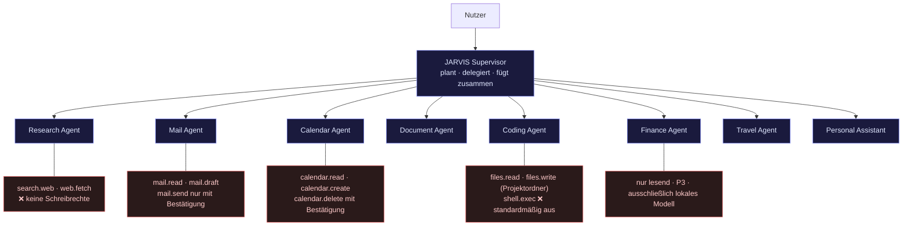
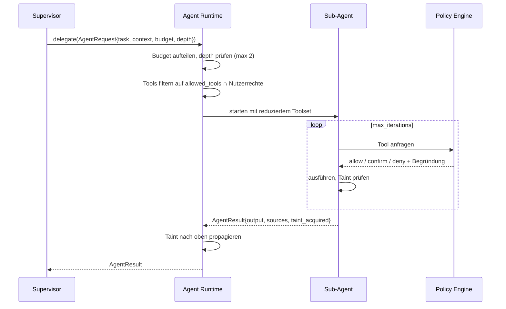

# Agenten- und Tool-Architektur

---

## 1. Muster: Supervisor mit Least-Privilege-Delegation



**Warum Supervisor und nicht ein Schwarm gleichberechtigter Agenten?** Weil in einem System mit Mail- und Kalenderzugriff die Frage „wer hat das ausgelöst?" jederzeit beantwortbar sein muss. Ein Peer-to-Peer-Agentennetz ist schwerer nachzuvollziehen, neigt zu Schleifen und macht Budgetkontrolle praktisch unmöglich. Der Supervisor ist zugleich der einzige Ort, an dem Kosten und Schritte gezählt werden.

**Least Privilege ist der eigentliche Grund für Sub-Agenten.** Der Research Agent liest Webseiten — also Fremdinhalt. Er besitzt strukturell keine sendenden Werkzeuge. Selbst wenn eine Webseite eine Anweisung enthält, gibt es keinen Pfad von dort zu `mail.send`. Sub-Agenten sind hier ein **Sicherheitsmechanismus**, nicht bloß eine Organisationsform.

---

## 2. Agentenvertrag

```python
class AgentSpec(BaseModel):
    name: str
    description: str  # der Supervisor liest das für die Delegation
    system_prompt: str
    allowed_tools: list[str]  # Whitelist, nie Blacklist
    max_data_class: DataClass  # begrenzt die Modellwahl innerhalb des Agenten
    model_preference: str | None
    max_iterations: int = 8
    accepts_untrusted_input: bool  # ⬅ darf dieser Agent Fremdinhalt lesen?
    can_delegate: bool = False  # nur der Supervisor: True


class AgentRequest(BaseModel):
    task: str
    context: ContextBundle
    budget: RunBudget
    parent_run_id: UUID
    depth: int  # Rekursionsschutz, max. 2


class AgentResult(BaseModel):
    status: Literal["success", "partial", "failed", "needs_confirmation"]
    output: str
    structured: dict | None
    sources: list[Source]  # Pflicht bei Research/Document
    tools_used: list[str]
    taint_acquired: bool  # ⬅ hat der Agent Fremdinhalt gelesen?
    usage: Usage
    followups: list[str]  # Vorschläge an den Supervisor
```

Das Feld `taint_acquired` propagiert nach oben: Sobald ein Sub-Agent Fremdinhalt gelesen hat, gilt der gesamte übergeordnete Lauf als kontaminiert.

---

## 3. Agentenkatalog

| Agent | Aufgabe | Tools | Besonderheit |
|---|---|---|---|
| **Supervisor** | Planung, Delegation, Zusammenführung | keine direkten Aktionstools | Einziger mit `can_delegate` |
| **Research** | Websuche, Quellenvergleich, Zusammenfassung | `search.web`, `web.fetch`, `web.extract` | `accepts_untrusted_input=True`, **null Schreibrechte** |
| **Mail** | Postfachanalyse, Priorisierung, Entwürfe | `mail.read`, `mail.search`, `mail.draft`, `mail.send`* | Entwurf ≠ Versand; `mail.send` immer bestätigungspflichtig |
| **Calendar** | Termine, Zeitfenster, Tagesplanung | `calendar.*`, `freebusy.query` | Konflikterkennung, Puffer- und Reisezeitlogik |
| **Document** | PDF/Office-Analyse, Zusammenfassung, Extraktion | `docs.search`, `docs.read`, `docs.extract` | Antwort nur mit Seiten-/Abschnittsbeleg |
| **Coding** | Code schreiben, lesen, erklären | `files.read`, `files.write`†, `git.*`, `shell.exec`‡ | `files.write` nur in freigegebenen Ordnern; `shell.exec` standardmäßig deaktiviert |
| **Finance** | Auswertung von Finanzdaten | nur lesende Tools | Fest `max_data_class = P3` → nur lokales Modell, **nie** transaktionsfähig |
| **Travel** | Reiseplanung, Routen, Abfahrtszeit | `search.web`, `maps.route`, `calendar.read` | Buchungen ausschließlich als Vorschlag |
| **Personal Assistant** | Aufgaben, Erinnerungen, Tagesüberblick | `tasks.*`, `reminders.*`, `calendar.read`, `mail.read` | Trägt die proaktiven Briefings |

\* bestätigungspflichtig  † pfadbeschränkt  ‡ Opt-in, Allowlist, nie in kontaminiertem Kontext

**Zum Finance Agent:** Er kann strukturell keine Transaktionen auslösen — es existiert kein entsprechendes Tool und keine Integration, die eines bereitstellt. Das ist keine Konfiguration, die man versehentlich umstellt, sondern eine Abwesenheit im Code.

---

## 4. Tool-Vertrag

Werkzeuge werden deklarativ registriert. Aus dem Decorator entstehen JSON-Schema (für das Modell), Validierung (Pydantic) und Dokumentation (`make gen`).

```python
@tool(
    name="send_email",
    description="Sendet eine E-Mail über das verbundene Konto.",
    scopes=["mail.send"],
    risk=RiskLevel.HIGH,
    data_class=DataClass.P2,
    idempotent=False,
    requires_preview=True,  # Bestätigung zeigt den echten Payload
    forbidden_when_tainted=True,  # ⬅ nicht ausführbar nach Fremdinhalt
    rate_limit="10/hour",
    timeout_s=30,
)
async def send_email(
    ctx: ToolContext,
    to: list[EmailStr],
    subject: str = Field(max_length=200),
    body: str = Field(max_length=50_000),
    cc: list[EmailStr] = [],
    attachments: list[AttachmentRef] = [],
) -> SendEmailResult: ...
```

### Felder des `ToolSpec`

| Feld | Zweck |
|---|---|
| `name`, `description` | Was das Modell sieht |
| `parameters` | Aus Signatur abgeleitetes JSON Schema |
| `returns` | Typisiertes Ergebnis |
| `scopes` | Benötigte Berechtigungen |
| `risk` | `LOW` / `MEDIUM` / `HIGH` / `CRITICAL` |
| `data_class` | Höchste Klasse der berührten Daten |
| `idempotent` | Steuert Retry-Verhalten |
| `requires_preview` | Erzwingt Preview-Objekt vor Ausführung |
| `forbidden_when_tainted` | Sperre bei kontaminiertem Kontext |
| `rate_limit`, `timeout_s` | Betriebsgrenzen |
| `undo` | Optionaler Rückgängig-Handler |

### Risikoklassen

| Stufe | Bedeutung | Standardverhalten | Beispiele |
|---|---|---|---|
| **LOW** | Lesend, lokal, folgenlos | ausführen | `get_time`, `calendar.read`, `tasks.list` |
| **MEDIUM** | Schreibend, umkehrbar | ausführen, im Protokoll sichtbar, Undo angeboten | `calendar.create`, `tasks.create`, `notes.write` |
| **HIGH** | Außenwirkung oder schwer umkehrbar | **Bestätigung mit Preview** | `mail.send`, `calendar.delete`, `files.write`, `smarthome.set` |
| **CRITICAL** | Irreversibel oder finanziell | Bestätigung + zweiter Faktor + niemals autonom | `files.delete`, `payment.*`, `shell.exec`, `account.modify` |

### Undo statt nur Bestätigung

Für MEDIUM-Tools ist ein `undo`-Handler wirksamer als ein weiterer Dialog. Ein angelegter Termin, der sich per Klick zurücknehmen lässt, erspart einen Bestätigungsschritt bei jeder Kalenderaktion — und Bestätigungsmüdigkeit ist ein reales Sicherheitsrisiko: Wer zwanzigmal am Tag „Ja" klickt, liest beim einundzwanzigsten Mal nicht mehr.

```python
class ToolResult(BaseModel):
    ok: bool
    data: dict | None
    display: str  # für die UI
    undo_token: str | None  # 15 min gültig
    sources: list[Source] = []
```

---

## 5. Handoff-Protokoll



**Toolfilterung als Schnittmenge:** Ein Agent bekommt nie mehr Rechte, als der Nutzer erteilt hat — auch wenn seine `allowed_tools` mehr enthalten. `effective = agent.allowed_tools ∩ user.granted_scopes ∩ (tainted ? safe_tools : all)`. Die Verengung geschieht an einer Stelle, in der Runtime, nicht in jedem Agenten.

---

## 6. Warum kein Multi-Agenten-Debatte-Muster

Ein naheliegender Gedanke wäre, mehrere Modelle dieselbe Frage beantworten und dann abstimmen zu lassen. Für dieses System lehne ich das im Standardpfad ab:

- Es verdreifacht Kosten und Latenz für einen in der Praxis kleinen Qualitätsgewinn bei Alltagsaufgaben.
- Bei Aufgaben mit Werkzeugeinsatz hilft es kaum — die Fehler liegen in Argumenten, nicht in Meinungen.

Sinnvoll ist es an genau zwei Stellen, und dort ist es vorgesehen:

1. **Recherche mit Entscheidungscharakter** („vergleiche Laptops unter 2.000 €") — mehrere Quellen unabhängig auswerten, dann zusammenführen. Hier ist die Redundanz der Punkt.
2. **Faktenprüfung vor Aktionen mit Außenwirkung** — ein zweiter, günstiger Aufruf prüft, ob die Argumente des Tool-Calls zum Nutzerwunsch passen. Kostet wenige Cent, verhindert die teuersten Fehler.

---

## 7. Proaktivität (Briefing §8)

Proaktive Meldungen entstehen aus Regeln, die der Scheduler auswertet — nicht daraus, dass ein Modell frei entscheidet, wann es dich anspricht.

```python
class ProactiveRule(BaseModel):
    name: str
    trigger: TriggerSpec  # cron | vor Termin | Mail-Match | Zustandswechsel
    condition: str  # auswertbarer Ausdruck, kein Freitext
    action: ProactiveAction
    channels: list[Literal["ui", "voice", "push"]]
    quiet_hours: tuple[time, time] | None
    max_per_day: int = 3
    enabled: bool = True
```

Startregeln:

| Regel | Auslöser | Ausgabe |
|---|---|---|
| Terminvorbereitung | 30 min vor Termin mit externen Teilnehmern | Letzte Mail-Konversation, offene Punkte, Ort |
| Morgenbriefing | werktags 07:30 | Wetter, Termine, dringende Mails, Top-3-Aufgaben |
| Tagesdichte | 08:00, wenn < 60 min freie Zeit | Warnung + Vorschlag zum Verschieben |
| Reisezeit | vor Terminen mit Ortsangabe | Abfahrtszeit inkl. aktueller Verkehrslage |
| Unbeantwortet | Mail von Priorität-Kontakt > 48 h ohne Antwort | Hinweis |
| Frist | Aufgabe mit `due_at` in < 24 h | Erinnerung |

**Alles einzeln abschaltbar, mit Ruhezeiten und Tageslimit.** Ein Assistent, der ungefragt und zu oft spricht, wird stummgeschaltet — dann nützt auch der gute Hinweis nichts. Standard nach Erstinstallation: nur Morgenbriefing und Terminvorbereitung aktiv.
