# Sprach-Architektur

---

## 1. Zwei mögliche Sprachpfade — und warum die Wahl grundlegend ist

Es gibt heute zwei fundamental verschiedene Wege, ein Sprachinterface zu bauen. Die Entscheidung prägt das gesamte System und ist später nur schwer umkehrbar.

| | **A — Pipeline** (STT → LLM → TTS) | **B — Realtime speech-to-speech** |
|---|---|---|
| Latenz | 700–1400 ms | 250–500 ms |
| Werkzeugeinsatz | Voll, beliebig komplex | Eingeschränkt, providerabhängig |
| Modellwahl | Frei pro Turn (Routing greift) | An einen Anbieter gebunden |
| Datenschutz | STT lokal möglich | Roh-Audio geht zwingend in die Cloud |
| Kosten | Nach Token | Nach Audiominute, deutlich teurer |
| Prosodie, Unterbrechung | Gut mit Aufwand | Exzellent |
| Provider-Unabhängigkeit | Gegeben | **Nicht gegeben** |

**Entscheidung: A als Standardpfad, B als optionaler Modus.**

Begründung: Pfad B verletzt drei Kernanforderungen des Briefings gleichzeitig — Provider-Unabhängigkeit (Regel 7), Datenklassifikation (P3 darf das Gerät nicht verlassen) und intelligentes Modellrouting (§2/§3). Ein Sprachinterface, das immer denselben Anbieter benutzt und immer Roh-Audio in die Cloud sendet, ist mit dem Rest der Architektur nicht vereinbar.

Pfad B bleibt als **„Konversationsmodus"** vorgesehen: ein bewusst aktivierter Zustand für längere, tool-arme Gespräche, in dem Latenz wichtiger ist als Kontrolle. Der Modus ist an eine eigene Berechtigung gebunden und für P2/P3-Kontexte gesperrt.

---

## 2. Sprachpipeline

```mermaid
flowchart LR
    A[Mikrofon<br/>16 kHz mono] --> RB[Ringpuffer<br/>3 s, nur RAM]
    RB --> WW[Wake Word<br/>openWakeWord ONNX<br/>~15 ms/Frame]
    WW -->|Treffer| VER[Verifikation<br/>2. Fenster + Schwelle]
    VER -->|bestätigt| VAD[Silero VAD<br/>Sprachgrenzen]
    VER -->|verworfen| RB
    VAD --> STT[faster-whisper<br/>streaming, lokal]
    STT --> NORM[Normalisierung<br/>Zahlen, Daten, Namen]
    NORM --> CORE[Orchestrator]
    CORE -->|token.delta| SB[Satz-Puffer]
    SB -->|vollständiger Satz| TTS[TTSProvider<br/>streaming]
    TTS --> AEC[Echo Cancellation]
    AEC --> SPK[Lautsprecher]
    SPK -.Referenzsignal.-> AEC
    VAD -.Sprache während Ausgabe.-> BI[Barge-in:<br/>TTS stoppen]
```



---

## 3. Wake Word

**Wahl: openWakeWord** (Apache-2.0, ONNX, lokal, eigene Wake Words trainierbar).

| Alternative | Pro | Contra |
|---|---|---|
| Porcupine (Picovoice) | Beste Genauigkeit, sehr niedrige Fehlauslösungsrate | Kommerzielle Lizenz, proprietär, Aktivierungsschlüssel |
| Snowboy | — | Eingestellt |
| Whisper dauerhaft laufen lassen | Kein Extramodell | Hoher Dauerverbrauch, hohe Latenz, unpraktikabel |

**Zweistufige Auslösung gegen Fehlalarme (R7):** Erster Treffer über dem Schwellwert startet eine Verifikation über ein zweites, leicht versetztes Fenster. Erst bei zwei Treffern öffnet das Mikrofon. Das senkt Fehlauslösungen deutlich, kostet ~150 ms — vertretbar, weil danach ohnehin auf Sprache gewartet wird.

**Ringpuffer:** Die letzten 3 Sekunden liegen im RAM, damit der Anfang eines direkt angehängten Satzes („Jarvis, wie ist das Wetter") nicht abgeschnitten wird. Bei Nichtauslösung wird der Puffer überschrieben — **niemals geschrieben, niemals gesendet**.

**Bedienmodi:**

| Modus | Verhalten |
|---|---|
| Wake Word | Dauerhaft lauschend, lokal |
| Push-to-Talk | Global Hotkey, kein Dauerlauschen |
| Open Mic | Nach Aktivierung 30 s ohne erneutes Wake Word (Folgefragen) |
| Aus | Mikrofon vollständig freigegeben |

---

## 4. Speech-to-Text

```python
class STTProvider(Protocol):
    async def transcribe(
        self, audio: AudioChunk, *, language: str | None, prompt: str | None
    ) -> Transcript: ...
    async def stream(
        self, chunks: AsyncIterator[AudioChunk]
    ) -> AsyncIterator[PartialTranscript]: ...
```

| Implementierung | Einsatz |
|---|---|
| `faster_whisper` (CTranslate2, `large-v3-turbo`, Metal) | **Standard.** Lokal, ~0,15× Echtzeit auf Apple Silicon, keine Datenübertragung |
| `openai` / `deepgram` | Optional bei P0/P1, wenn Cloud-Genauigkeit gewünscht |

**Qualitätsverbesserungen, die spürbar wirken:**

- **Kontext-Prompt:** Namen aus deinen Kontakten, aktuelle Projektbezeichnungen und Kalendertitel werden als `initial_prompt` übergeben. Das verbessert Eigennamen-Erkennung erheblich — genau die Wörter, bei denen generisches Whisper am häufigsten scheitert.
- **Sprachmischung:** Deutsch mit englischen Fachbegriffen ist der Normalfall. Sprache auf `de` fixieren statt automatisch erkennen, da Autodetektion bei kurzen Äußerungen unzuverlässig ist.
- **Normalisierung nach dem Transkript:** „acht uhr dreißig" → `08:30`, „zwanzig prozent" → `20 %`. Deterministisch, kein Modellaufruf.

---

## 5. Text-to-Speech

```python
class TTSProvider(Protocol):
    async def synthesize(self, text: str, voice: VoiceId) -> AudioStream: ...
    def voices(self) -> list[Voice]: ...
    @property
    def supports_streaming(self) -> bool: ...
```

| Implementierung | Einsatz | Latenz bis erstes Audio |
|---|---|---|
| ElevenLabs | Höchste Natürlichkeit, deutsche Stimmen sehr gut | ~250 ms (streaming) |
| OpenAI TTS | Gute Qualität, günstiger | ~350 ms |
| Piper (lokal) | Offline, P3, kostenlos | ~100 ms, hörbar synthetischer |
| macOS `AVSpeechSynthesizer` | Notfall-Fallback | sofort |

**Stimmprofil laut Briefing** — ruhig, intelligent, professionell, leicht futuristisch: Erreicht über Stimmauswahl plus konservative Prosodie-Einstellungen (moderate Geschwindigkeit, geringe Expressivität, keine Emotionalisierung). Wichtiger als die Stimme selbst ist das **Antwortverhalten**: kurze Sätze, keine Füllwörter, keine Wiederholung der Frage. Das wird über den System-Prompt für den Sprachkanal gesteuert, der sich vom Textkanal unterscheidet.

**Satzweise Synthese:** Der Satz-Puffer erkennt Satzenden im Token-Strom und schickt jeden fertigen Satz sofort an TTS. Die wahrgenommene Antwortzeit sinkt dadurch von „Ende der Generierung" auf „Ende des ersten Satzes" — bei längeren Antworten mehrere Sekunden Unterschied.

---

## 6. Latenzbudget

Zielwert für einen einfachen Sprachdialog: **unter 1,2 s** vom Ende der Äußerung bis zum ersten hörbaren Wort.

| Stufe | Ziel | Anmerkung |
|---|---|---|
| VAD-Endpunkterkennung | 180 ms | Kompromiss: kürzer schneidet Sprecher ab |
| STT (lokal, streaming) | 150 ms | Teiltranskripte laufen bereits während des Sprechens |
| Klassifikation (lokal) | 100 ms | Entfällt bei Regel-Abkürzung |
| Kontext laden | 80 ms | Nur `free`- und `db`-Provider im Sprachpfad |
| LLM bis erstes Token | 400 ms | Dominante Größe; abhängig von Modell und Prompt-Länge |
| Satz-Puffer bis erstes Satzende | 120 ms | |
| TTS bis erstes Audio | 250 ms | |
| **Summe** | **~1,28 s** | |

**Optimierungen, die im Entwurf verankert sind:**

- **Spekulativer Start:** Klassifikation und Kontextladen beginnen auf dem Teiltranskript, bevor der Nutzer ausgesprochen hat. Bei Abweichung wird verworfen — die eingesparte Zeit überwiegt die verworfene Arbeit deutlich.
- **Kurzer Prompt im Sprachkanal:** Kontextbudget 4.000 statt 16.000 Token. Der Zusammenhang zwischen Prompt-Länge und Zeit bis zum ersten Token wird oft unterschätzt.
- **Vorgewärmtes lokales Modell:** Ollama hält das Klassifikationsmodell geladen (`keep_alive`).
- **Regel-Abkürzung:** Uhrzeit, Timer, Lautstärke, „stopp" umgehen den Modellpfad vollständig — Antwort in unter 200 ms.

---

## 7. Barge-in und Echounterdrückung

Der Nutzer muss JARVIS unterbrechen können. Das erfordert, dass das Mikrofon während der Ausgabe offen bleibt — was ohne Echounterdrückung dazu führt, dass JARVIS sich selbst hört und unterbricht.

| Problem | Lösung |
|---|---|
| Selbsthören | **AEC** (WebRTC APM oder speexdsp) mit dem TTS-Signal als Referenz |
| Wann ist es eine Unterbrechung? | VAD + Mindestdauer 300 ms + Energieschwelle über AEC-Restsignal |
| Reaktion | TTS sofort stoppen, Wiedergabepuffer verwerfen, laufenden Run als `interrupted` markieren |
| Kopfhörer | AEC nicht nötig, Pfad wird automatisch übersprungen |

Der Zustand `interrupted` ist wichtig: Der Orchestrator weiß dann, dass die Antwort unvollständig geblieben ist, und bezieht das in den nächsten Turn ein („Du hattest mich unterbrochen — soll ich den Rest?").

---

## 8. Edge-Daemon-Protokoll

Der Edge Daemon (ADR-011) spricht über eine eigene WebSocket-Verbindung mit dem Kern:

```
→ edge.hello        { device_id, capabilities: [mic, speaker, camera] }
→ edge.wake         { confidence, timestamp }
→ edge.transcript   { text, is_final, confidence, language }
→ edge.gesture      { gesture, confidence }          (siehe 09-vision-gesture.md)
→ edge.state        { mic: on|off|muted, camera: on|off, aec: bool }

← tts.stream        { audio_chunk }  (binär)
← tts.stop          { reason: "barge_in" | "cancelled" }
← edge.command      { set_mic, set_camera, set_wake_mode }
← ui.state          { core_state: idle|listening|thinking|speaking|executing|error }
```

**Was hier nicht übertragen wird:** Roh-Audio und Videoframes. Das ist keine Konvention, sondern durch die Protokolldefinition erzwungen — es existiert kein Nachrichtentyp dafür.

---

## 9. Betriebszustände und ihre Sichtbarkeit

| Zustand | Edge | UI (AI Core) | Hörbar |
|---|---|---|---|
| `idle` | Wake Word aktiv | ruhige Pulsation | — |
| `listening` | Aufnahme läuft | Audio-Wellenform live | kurzer Aktivierungston |
| `thinking` | — | dichtere Animation + Modellname | — |
| `speaking` | TTS-Wiedergabe | Ausgabe-synchrone Visualisierung | Sprache |
| `executing` | — | Fortschritt je Planschritt | — |
| `error` | — | Warnzustand + Klartext | kurzer Fehlerton |
| `muted` | Mikrofon hardwarenah aus | deutlich sichtbarer Zustand | — |

Der Mikrofonzustand muss **immer und ohne Interpretationsspielraum** erkennbar sein. Ein Assistent, bei dem unklar ist, ob er zuhört, wird nicht benutzt.
