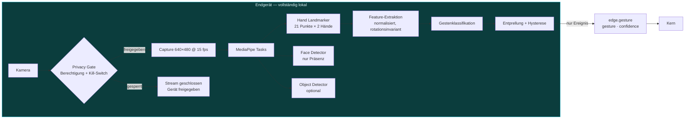

# Vision- und Gesten-Architektur

> Vorbemerkung: Von allen Modulen hat dieses das ungünstigste Verhältnis von Aufwand zu Alltagsnutzen. Es ist vollständig entworfen und in Phase 6 vorgesehen — ich empfehle aber, es erst zu bauen, wenn Phase 1–5 täglich im Einsatz sind, und den Umfang auf wenige Gesten mit klarem Zweck zu begrenzen.

---

## 1. Grundsatz: Frames verlassen das Gerät nie



An den Kern geht ausschließlich `{gesture: "confirm", confidence: 0.94}`. Es gibt im Protokoll keinen Nachrichtentyp für Bilddaten — die Zusicherung ist strukturell, nicht organisatorisch.

**Ausnahme mit ausdrücklicher Freigabe:** Für „was steht auf diesem Dokument?" oder „was hältst du von diesem Bild?" wird ein Einzelbild aufgenommen und an ein Vision-Modell gesendet. Das ist eine bewusste, sichtbare Einzelaktion mit eigenem Scope (`camera.capture`), keine laufende Übertragung.

---

## 2. Technologiewahl: MediaPipe Tasks

**Warum:** Google MediaPipe liefert vortrainierte, auf Echtzeit optimierte Modelle für Hand-Landmarks (21 Punkte je Hand), Gesichts- und Objekterkennung, läuft auf CPU mit ~10–20 ms je Frame und ist Apache-2.0-lizenziert. Der entscheidende Punkt: Es liefert **Landmarks statt Klassifikationen**. Daraus lassen sich beliebige eigene Gesten ableiten, ohne ein Modell neu zu trainieren — genau die Erweiterbarkeit, die das Briefing (§11) fordert.

| Alternative | Pro | Contra |
|---|---|---|
| YOLO-Pose | Sehr genau, GPU-beschleunigt | Schwerer, mehr Aufwand für Hände speziell |
| OpenCV klassisch (Haar/Kontur) | Keine ML-Abhängigkeit | Bei wechselndem Licht unbrauchbar |
| Eigenes CNN | Maßgeschneidert | Trainingsdaten, Aufwand — nicht gerechtfertigt |
| Apple Vision Framework | Native Performance auf macOS | Plattformgebunden, widerspricht Geräteunabhängigkeit |

**Python 3.12 ist hier bindend** (ADR-001): MediaPipe-Wheels hinken neueren Python-Versionen deutlich hinterher.

---

## 3. Gestenklassifikation

Zwei Klassen von Gesten, technisch verschieden behandelt:

### Statische Posen (Handform)

Aus den 21 Landmarks wird ein normalisierter Merkmalsvektor gebildet — **rotations-, skalierungs- und positionsinvariant**, sonst funktioniert Erkennung nur bei exakt einer Handhaltung:

```python
def features(landmarks: list[Point3D]) -> np.ndarray:
    origin = landmarks[0]  # Handgelenk
    pts = np.array([[p.x, p.y, p.z] for p in landmarks]) - origin
    scale = np.linalg.norm(pts[9])  # Mittelfinger-Grundgelenk
    pts /= max(scale, 1e-6)
    pts = align_to_canonical_rotation(pts)  # Handrücken-Ebene normalisieren
    return np.concatenate(
        [
            pts.flatten(),  # 63 Werte
            finger_extension_ratios(pts),  # 5 — gestreckt vs. gebeugt
            inter_finger_angles(pts),  # 4
            thumb_orientation(pts),  # 3 — für Daumen hoch/runter
        ]
    )
```

Klassifikation über einen kleinen k-NN oder ein flaches MLP, trainiert auf wenigen Dutzend eigenen Beispielen je Geste. **Bewusst kein tiefes Modell** — bei 75 Merkmalen und 8 Klassen wäre das überdimensioniert, langsamer und schwerer nachvollziehbar.

### Dynamische Gesten (Bewegung)

Ein Ringpuffer der letzten 20 Frames (~1,3 s) wird auf Trajektorienmerkmale geprüft: Richtung, Geschwindigkeit, Amplitude. Für Wischbewegungen genügen Schwellwertregeln; für komplexere Bewegungen ist DTW-Abgleich gegen aufgezeichnete Vorlagen vorgesehen.

---

## 4. Deklarative Gesten-Registry

Neue Gesten sollen ohne Codeänderung hinzufügbar sein (Briefing §11):

```json
{
  "gestures": [
    {
      "id": "confirm",
      "label": "Daumen hoch",
      "type": "static",
      "model_ref": "thumbs_up",
      "min_confidence": 0.90,
      "hold_ms": 400,
      "cooldown_ms": 1200,
      "action": { "kind": "confirm_pending_action" },
      "allowed_contexts": ["awaiting_confirmation"],
      "max_risk": "HIGH"
    },
    {
      "id": "activate",
      "label": "Offene Handfläche",
      "type": "static",
      "model_ref": "open_palm",
      "min_confidence": 0.92,
      "hold_ms": 700,
      "action": { "kind": "wake" },
      "allowed_contexts": ["idle"]
    },
    {
      "id": "mute",
      "label": "Faust",
      "type": "static",
      "model_ref": "fist",
      "hold_ms": 500,
      "action": { "kind": "mute_microphone" },
      "allowed_contexts": ["*"]
    },
    {
      "id": "panel_next",
      "label": "Wischen rechts",
      "type": "dynamic",
      "trajectory": { "axis": "x", "direction": 1, "min_velocity": 0.8 },
      "action": { "kind": "ui_navigate", "target": "next_panel" }
    }
  ]
}
```

Die drei Felder `hold_ms`, `cooldown_ms` und `allowed_contexts` sind das, was Gestensteuerung von einer Spielerei zu etwas Benutzbarem macht:

- **`hold_ms`** verhindert, dass beiläufige Handbewegungen auslösen.
- **`cooldown_ms`** verhindert Mehrfachauslösung derselben Geste.
- **`allowed_contexts`** verhindert, dass „Daumen hoch" im Leerlauf irgendetwas bestätigt. Eine Bestätigungsgeste existiert nur, wenn tatsächlich etwas zu bestätigen ist.

`max_risk: HIGH` bedeutet: `CRITICAL`-Aktionen sind per Geste **nicht** bestätigbar. Ebenso wie bei Sprache (`07-security §5`) ist die Fehlerrate zu hoch für Irreversibles.

---

## 5. Empfohlener Gestenumfang

| Geste | Aktion | Nutzen |
|---|---|---|
| Offene Handfläche (halten) | Aktivieren | Aktivierung ohne Sprechen, z. B. in Anwesenheit anderer |
| Daumen hoch | Bestätigen | Nur bei ausstehender Bestätigung |
| Daumen runter | Ablehnen | dito |
| Faust | Mikrofon stummschalten | Der praktisch wertvollste Fall: schnelles Stoppen |
| Wischen links/rechts | Panel wechseln | Bedienung aus Distanz |

Fünf Gesten. Mehr wird nicht gemerkt und nicht benutzt. Die Registry erlaubt beliebig viele — die Empfehlung bleibt, klein zu bleiben.

---

## 6. Privacy Gate

| Schutz | Umsetzung |
|---|---|
| Standardzustand | `camera.access = deny`. Nach Installation ist die Kamera aus. |
| Freigabe | Ausdrücklich im Permission Center, mit Erklärung, was verarbeitet wird |
| Sichtbarkeit | Deutlicher Indikator in der UI, solange der Stream offen ist; System-Kameraleuchte ohnehin |
| Kill-Switch | Ein Klick/eine Geste schließt den Stream und gibt das Gerät frei (nicht nur „pausiert") |
| Zeitgrenze | Nach 30 min ohne erkannte Aktivität schließt der Stream automatisch |
| Persistenz | Keine. Frames werden nach Verarbeitung verworfen, es gibt keinen Schreibpfad. |
| Audit | Jedes Öffnen und Schließen des Streams im Audit-Log |
| Gesichtserkennung | **Nur Präsenz** („eine Person anwesend"), keine Identifikation, keine Gesichtsvektoren |

Die letzte Zeile ist bewusst: Biometrische Identifikation wäre technisch einfach ergänzbar und rechtlich (DSGVO Art. 9, besondere Kategorien) sowie praktisch heikel, insbesondere sobald Dritte im Kamerabild sind. Sie ist nicht vorgesehen.

---

## 7. Ressourcenverbrauch

MediaPipe bei 640×480 und 15 fps kostet auf Apple Silicon grob 8–15 % einer Kernauslastung. Das ist vertretbar für einen aktiv genutzten Modus, aber nicht für Dauerbetrieb im Hintergrund.

Deshalb:

- **Kamera läuft nicht dauerhaft.** Aktivierung durch UI-Schalter, Sprachbefehl oder Anwesenheit im Dashboard-Vollbild.
- **Adaptive Bildrate:** 15 fps bei erkannter Hand, 5 fps im Ruhezustand.
- **Automatisches Abschalten** bei Inaktivität und im Akkubetrieb unter 20 %.

---

## 8. Bildschirmanalyse (Briefing §10)

„Bildschirminhalte erkennen" ist bewusst **kein** Kamerapfad, sondern ein Screenshot-Pfad mit eigenem Scope (`screen.capture`):

1. Nutzer fordert es an („was siehst du hier?").
2. Screenshot des aktiven Fensters, nicht des gesamten Bildschirms.
3. **Vorschau vor dem Senden** — du siehst, was übertragen würde.
4. Automatische Maskierung erkannter sensibler Muster (Passwortfelder, IBAN, Kartennummern) vor der Übertragung.
5. Datenklassifikation P2 → Routing an ein dafür freigegebenes Vision-Modell, sonst lokal.

Kein automatisches, kontinuierliches Mitlesen des Bildschirms. Ein System, das dauerhaft deinen Bildschirm an ein Cloud-Modell sendet, ist mit der Datenklassifikation aus `00-uebersicht.md §8` nicht vereinbar.
