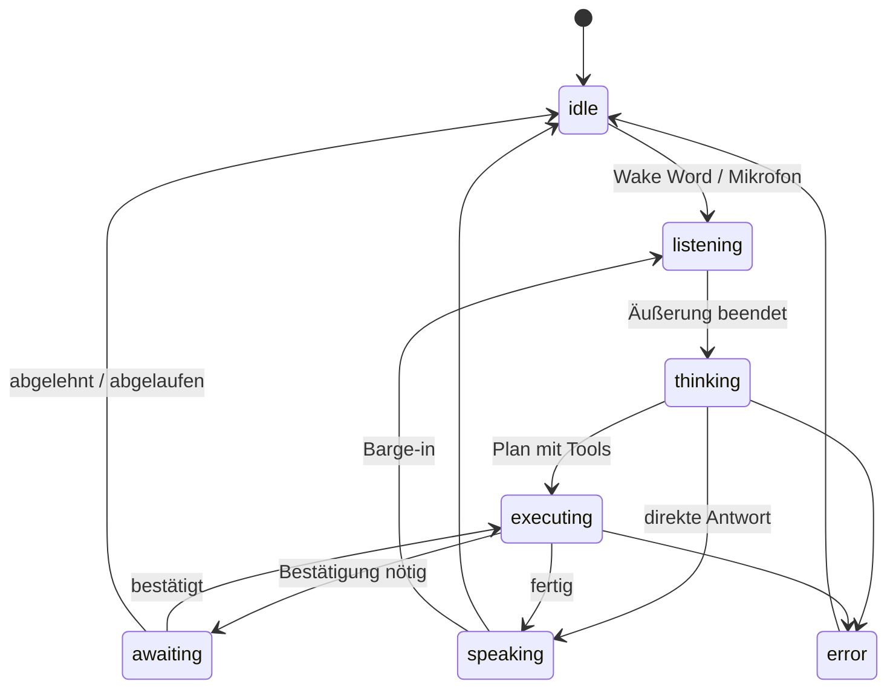

# Frontend-Architektur

---

## 1. Gestaltungsziel

Die Oberfläche soll sich wie ein **Kommandozentrum** anfühlen, nicht wie ein Chatfenster mit dunklem Thema. Der Unterschied liegt weniger in Effekten als in drei Eigenschaften:

1. **Zustand ist immer sichtbar.** Was JARVIS gerade tut, welches Modell arbeitet, welcher Planschritt läuft, was ansteht — ohne dass man danach suchen muss.
2. **Der Kern reagiert.** Die zentrale Darstellung ist an echte Zustände gebunden, nicht dekorativ animiert.
3. **Ruhe im Normalzustand.** Ein Interface, das dauerhaft flimmert, ist nach zwei Tagen anstrengend. Bewegung entsteht durch Aktivität, nicht durch Leerlauf.

Der visuelle Bezug zum Vorbild entsteht über eigene Gestaltung: dunkler Grund, monochrome Akzentfarbe mit Leuchtwirkung, dünne Linien, transparente Ebenen, technische Typografie. Keine übernommenen Assets, keine nachgebauten Markenelemente.

---

## 2. Struktur

```
┌──────────────────────────────────────────────────────────────────┐
│  JARVIS          ● online   ◐ Opus 5   ⚡ 0,42 €   🎤 aktiv       │  Statusleiste
├────────────────┬────────────────────────────────┬────────────────┤
│  KALENDER      │                                │  POSTEINGANG   │
│  09:00 Standup │                                │  ● Thomas M.   │
│  14:00 Kunde   │          ◉  AI CORE            │    Angebot X   │
│                │        (zustandsgebunden)      │  ○ Newsletter  │
│  AUFGABEN      │                                │                │
│  ▸ Angebot X   │                                │  SYSTEM        │
│  ▸ Steuer      │                                │  LLM      ●    │
│                │                                │  Mail     ●    │
│  ERINNERUNGEN  │                                │  Kalender ●    │
│  17:00 Anruf   │                                │  Edge     ●    │
├────────────────┴────────────────────────────────┴────────────────┤
│  ▸ 15:42:01  Anfrage erkannt                                      │  Aktivität
│  ▸ 15:42:01  Modell: Opus 5 — mehrschrittige Planung              │
│  ▸ 15:42:02  Kalender abgefragt (218 ms)                          │
│  ▸ 15:42:03  Termin gefunden: 14:00 Kunde                         │
├──────────────────────────────────────────────────────────────────┤
│  [🎤]  Sprich oder schreibe…                          [Voice|Text]│
└──────────────────────────────────────────────────────────────────┘
```

---

## 3. AI Core

Zentrale Darstellung, gebunden an eine Zustandsmaschine:



| Zustand | Darstellung | Technik |
|---|---|---|
| `idle` | Langsame, gleichmäßige Pulsation, geringe Helligkeit | Shader, ~2 % GPU |
| `listening` | Ringe folgen dem Mikrofonpegel in Echtzeit | Amplitude per WS, 30 fps |
| `thinking` | Dichtere, unruhigere Struktur; Modellname eingeblendet | Rauschbasierter Shader |
| `executing` | Fortschrittsring, je Planschritt ein Segment | Segmente aus `run.plan` |
| `speaking` | Wellenform synchron zur Ausgabe | Frequenzanalyse des TTS-Streams |
| `awaiting` | Ruhender Zustand mit deutlichem Akzent | keine Animation — Aufmerksamkeit auf den Dialog |
| `error` | Warnfarbe, langsame Pulsation | |

**Umsetzung:** react-three-fiber mit eigenem GLSL-Fragment-Shader auf einer Ebene (kein 3D-Modell, keine Partikelsysteme mit tausenden Objekten). Ein einzelner Shader-Pass ist deutlich effizienter als DOM- oder Canvas-Partikel und läuft auf integrierter Grafik problemlos.

**Rendering-Budget:**

| Grenze | Wert |
|---|---|
| Bildrate | 60 fps, im `idle` gedrosselt auf 30 |
| GPU-Zeit je Frame | < 4 ms |
| Bundle-Größe des Core-Moduls | < 120 kB gzip |
| Fallback | Bei `prefers-reduced-motion` oder fehlendem WebGL: statische CSS-Darstellung mit Zustandsfarben |

Der Fallback ist keine Kür — ohne ihn ist die Anwendung auf schwächeren Geräten unbenutzbar und für Nutzer mit Bewegungsempfindlichkeit unzumutbar.

---

## 4. Zustandsverwaltung

| Art | Werkzeug | Begründung |
|---|---|---|
| Serverdaten (Kalender, Mail, Tasks) | TanStack Query | Cache, Invalidierung, Hintergrund-Refetch |
| Echtzeit (Run-Fortschritt, Core-Zustand) | Zustand-Store, gespeist aus WebSocket | Hochfrequent, gehört nicht in einen Query-Cache |
| Formulare | React Hook Form + Zod | Zod-Schemata sind generiert (ADR-006) |
| Routing | Next.js App Router | |

**Grundsatz: Der Server ist die Quelle der Wahrheit.** Der Client hält keinen abgeleiteten Zustand, den er selbst fortschreibt. Bei Verbindungsabbruch wird nach Wiederherstellung der Zustand neu geladen, nicht rekonstruiert — sonst driftet die Anzeige, und bei einem System mit Bestätigungsdialogen ist eine driftende Anzeige gefährlich.

**WebSocket-Resilienz:** Exponentielles Reconnect, sichtbarer Verbindungszustand in der Statusleiste, Nachrichten-Sequenznummern zur Lückenerkennung, Nachladen verpasster Ereignisse über `GET /v1/runs/{id}/steps`.

---

## 5. Chat-Modus

| Fähigkeit | Umsetzung |
|---|---|
| Markdown | `react-markdown` + `remark-gfm`, **ohne** `rehype-raw` (kein rohes HTML aus Modellausgaben) |
| Code | Shiki **über Token, nicht über HTML**; Sprache aus dem Markdown-Zaun; Kopierbutton |
| Tabellen | GFM, horizontal scrollbar |
| Bilder/Dateien | Drag & Drop, Vorschau, Größenlimit |
| Dokumente | Upload → Ingestion-Job → Fortschritt im Chat |
| Quellen | Zitatmarken mit Sprung zur Quelle, Dokument + Seite |
| Tool-Aktionen | Aufklappbare Karte je Tool: Argumente, Ergebnis, Dauer, Undo |
| Streaming | Token-weise, mit sichtbarem Modellwechsel bei Failover |

**Sicherheitshinweis:** Kein `dangerouslySetInnerHTML`, kein rohes HTML aus Modell- oder Fremdinhalt. Eine per Mail eingeschleuste HTML-Injektion, die im Chat gerendert wird, wäre ein direkter XSS-Pfad in eine Anwendung mit Postfachzugriff.

**Zur Zeile „Code" im Einzelnen** (umgesetzt in `apps/web/src/teile/Quelltext.tsx`):

* **Token statt HTML.** Der übliche Weg mit Shiki ist `codeToHtml` samt
  `dangerouslySetInnerHTML` — also genau der, den der Hinweis darüber
  ausschließt. Über `codeToTokens` kommt eine Liste aus Inhalt und Farbe
  zurück; React setzt den Inhalt als Text und die Farbe als `style`. Dass Shiki
  selbst maskiert, wäre kein Ersatz: Das wäre eine Zusage über eine fremde
  Bibliothek und ihre nächste Version.
* **Sprachen aus dem Zaun, nicht geraten.** Eingefärbt wird, was in der
  Auszeichnung steht (```` ```python ````) und in der Liste geführter Sprachen
  vorkommt. Zu *raten* färbt im Zweifel falsch ein, und eine falsche
  Einfärbung ist schlechter als keine — sie behauptet etwas über den Text.
* **Die Farbe kommt nach.** Der Block steht sofort als schlichter Text da;
  Shiki wird nachgeladen. Ein Fehlschlag beim Laden kostet Farbe, nicht
  Quelltext.
* **Der Kopierknopf sagt, wenn er nicht konnte.** Die Zwischenablage ist nicht
  in jedem Kontext zugänglich; ein Knopf, der dann „kopiert" behauptet, lässt
  jemanden einfügen, was nicht da ist.

---

## 5a. Gestaltungsidee: das HUD-Vorbild

**Status: Idee, nichts davon gebaut.** Quelle ist ein Obsidian-Theme-Paket
(`~/Downloads/jarvis-hud.zip`, fünf CSS-Snippets, drei Ausbaustufen von ruhig
bis überladen). Der Code selbst ist nicht übertragbar — er hängt an
Obsidian-Selektoren. Die Entwurfsentscheidungen darin sind es.

**Was zu übernehmen wäre:**

* **Eine Zahl, aus der sich alles ableitet.** Dort steht ein einziges
  RGB-Tripel, und Akzent, Glut, Schimmer und Rahmen folgen daraus. Unser
  `stil.css` führt neun feste Hex-Werte nebeneinander; ein Farbwechsel heißt
  dort neun Änderungen und neun Gelegenheiten, eine zu vergessen. Das ist
  unabhängig vom Aussehen die bessere Bauart.
* **„Haarlinien statt Kästen, Bewegung ausschließlich im Rahmen, Lesezone
  still."** Der Leitsatz der ruhigen Stufe — und für dieses Projekt fast ein
  Sicherheitsargument: Der Bestätigungsdialog ist der wichtigste
  Einzelbildschirm (§4). Eine Oberfläche, die dort ruhig bleibt und ihre
  Zustandsanzeige an den Rand legt, unterstützt genau die Aufmerksamkeit, von
  der die Bestätigung lebt.
* **Notbremsen.** Jeder Effekt einzeln abschaltbar, dokumentiert, mit
  Reihenfolge für den Fall, dass es stört.

**Zwei Dinge, die so nicht gehen:**

1. **Keine Schriften aus dem Netz.** Die Vorlage lädt Orbitron und Rajdhani per
   `@import` von Google. Ein selbst gehostetes Assistenzsystem, das bei jedem
   Laden einen Dritten kontaktiert, verrät IP und Nutzungszeiten — dasselbe
   Muster, das in §5 beim Markdown-Bild als Ausleitungskanal behandelt wird.
   Wer diese Schriften will, liefert sie mit.
2. **Nicht die oberste Ausbaustufe.** Glitch auf Überschriften, Filmkorn,
   Textglimmen, Bewegung unter dem Lesetext: Was die Aufmerksamkeit senkt,
   senkt sie genau dort, wo die Bestätigung ihren Zweck hat — dieselbe
   Überlegung, aus der `calendar.create` auf `supports_undo=False` steht.
   Vorbild ist die ruhige Stufe.

---

## 6. Permission Center

Drei Bereiche:

**Berechtigungen** — Liste aller Scopes, gruppiert nach Domäne, jeweils mit Modus (Erlauben / Bestätigen / Verweigern), Einschränkungen (Ordner, Empfänger, Beträge, Zeitfenster), Ablaufdatum und Nutzungsstatistik („in den letzten 30 Tagen 14× verwendet").

**Gedächtnis** — Alle Einträge mit Provenienz, Konfidenz und Zeitpunkt. Suchbar, einzeln bearbeitbar und löschbar. Kandidaten-Queue zur Bestätigung. Schalter für den privaten Modus. Export.

**Verbundene Konten** — Google, Microsoft, Plugins: erteilte Scopes, letzter Sync, Status, Trennen.

Ein Nutzer, der nicht in unter einer Minute beantworten kann „darf JARVIS Mails senden?" und „was weiß JARVIS über mich?", wird dem System nicht vertrauen — zu Recht.

---

## 7. Bestätigungsdialog

Der wichtigste einzelne Screen des Systems.

```
┌─────────────────────────────────────────────────┐
│  ⚠  Bestätigung erforderlich                     │
│                                                  │
│  E-Mail senden                       Risiko: HOCH│
│  ─────────────────────────────────────────────── │
│  An       thomas.mueller@kunde.de                │
│  Betreff  Re: Angebot Projekt X                  │
│                                                  │
│  Sehr geehrter Herr Müller,                      │
│  vielen Dank für Ihre Nachricht. Ich melde       │
│  mich morgen mit den Details zurück.             │
│  …                                    [erweitern]│
│  ─────────────────────────────────────────────── │
│  Grund: Aktion mit Außenwirkung, nicht rückholbar│
│  Gültig noch: 9:42                               │
│                                                  │
│            [ Abbrechen ]   [ Senden ]            │
└─────────────────────────────────────────────────┘
```

Regeln:

- Gerendert wird das **validierte Argument-Objekt**, nicht ein vom Modell formulierter Text.
- Bestätigungsschaltfläche ist die ersten 800 ms inaktiv (gegen Reflexklicks).
- Empfänger außerhalb von Kontakten und bisherigem Thread werden hervorgehoben.
- Bei kontaminiertem Kontext (`tainted`) erscheint stattdessen die Sperrmeldung mit Erklärung und dem Angebot, die Aktion selbst neu zu formulieren.

---

## 8. Design-Tokens

```css
:root {
  --bg-void:        #05070a;
  --bg-panel:       rgba(13, 20, 28, 0.72);
  --border-subtle:  rgba(56, 189, 248, 0.16);

  --accent:         #38bdf8;    /* Primärakzent */
  --accent-glow:    rgba(56, 189, 248, 0.42);
  --accent-warm:    #fbbf24;    /* Aufmerksamkeit */
  --danger:         #f87171;    /* Fehler, kritisches Risiko */
  --success:        #4ade80;

  --text-primary:   #e2e8f0;
  --text-secondary: #94a3b8;
  --text-dim:       #475569;

  --font-ui:        "Inter", system-ui, sans-serif;
  --font-mono:      "JetBrains Mono", ui-monospace, monospace;

  --ease-core:      cubic-bezier(0.22, 1, 0.36, 1);
  --dur-fast:       140ms;
  --dur-normal:     240ms;
}
```

Ein einziger Akzentton, sparsam eingesetzt. Farbe trägt hier Bedeutung — Blau für normal, Bernstein für Aufmerksamkeit, Rot für Gefahr. Sobald mehrere dekorative Farben hinzukommen, verliert das Risiko-Signal seine Wirkung.

**Barrierefreiheit:** Kontrastverhältnis mindestens 4,5:1 für Fließtext auch auf transparenten Ebenen (deshalb `--bg-panel` mit hoher Deckkraft); vollständige Tastaturbedienbarkeit; `aria-live` für Statusänderungen und eingehende Antworten; `prefers-reduced-motion` schaltet alle Animationen ab.

---

## 9. Layout und Geräte

| Breite | Layout |
|---|---|
| ≥ 1440 px | Volles Dreispalten-Kommandozentrum |
| 1024–1439 px | Seitenpanels als Tabs, Core zentral |
| < 1024 px | Core oben verkleinert, Chat dominant, Panels als Schublade |
| Mobil (Phase 8) | Sprache und Chat im Vordergrund, Dashboard sekundär |

Auf dem Telefon ist das Kommandozentrum-Layout sinnlos — dort zählen Spracheingabe, Antworten und Bestätigungen. Die Panels sind dort erreichbar, aber nicht die Startansicht.
