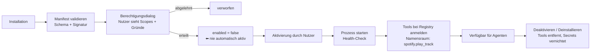

# Plugin-System

---

## 1. Grundsatz: MCP als Plugin-Protokoll

**Entscheidung:** Externe Plugins sprechen das **Model Context Protocol** (MCP). Ein eigenes Plugin-Protokoll wird nicht erfunden.

**Warum:** MCP ist bereits das, was hier gebraucht wird — ein Prozessprotokoll, über das ein separater Dienst Werkzeuge mit JSON-Schema anbietet. Es bringt Prozessisolation von Haus aus mit (Plugin läuft nicht im API-Prozess), und es existiert bereits ein Ökosystem an Servern für Slack, GitHub, Notion, Home Assistant und andere Systeme aus deiner Liste. Ein eigenes Protokoll würde dieselben Probleme noch einmal lösen, ohne das Ökosystem zu erben.

**Zwei Plugin-Arten:**

| Art | Ausführung | Für wen |
|---|---|---|
| **MCP-Plugin** | Eigener Prozess, stdio oder HTTP | Standard — fremde und eigene Plugins |
| **Natives Plugin** | Python-Modul, in-process | Nur eigener, geprüfter Code (z. B. Hausautomation mit lokalem Sonderfall) |

---

## 2. Manifest

Jedes Plugin deklariert vollständig, was es tut und was es braucht — **vor** der Installation, nicht zur Laufzeit.

```yaml
name: spotify
version: 1.2.0
description: Musiksteuerung über Spotify Connect
author: …
runtime: mcp                          # mcp | native
entrypoint: "npx -y @example/spotify-mcp"

permissions:
  - scope: music.read
    reason: "Aktuellen Titel und Wiedergabeliste anzeigen"
    risk: low
  - scope: music.control
    reason: "Wiedergabe starten, pausieren, Titel wechseln"
    risk: low

tools:
  - name: play_track
    risk: LOW
    data_class: P0
    forbidden_when_tainted: false
  - name: set_volume
    risk: LOW
    data_class: P0

network:
  allowed_hosts: ["api.spotify.com", "accounts.spotify.com"]

secrets:
  - key: SPOTIFY_CLIENT_ID
  - key: SPOTIFY_CLIENT_SECRET

ui:
  panel: optional                     # eigenes Dashboard-Panel
  icon: "music"
```

**Die Felder `permissions[].reason` und `network.allowed_hosts` sind Pflicht.** Ersteres, weil die Freigabeoberfläche dem Nutzer erklären muss, wofür ein Recht gebraucht wird. Zweiteres, weil ein Plugin ohne Hostbeschränkung ein potenzieller Exfiltrationskanal ist — die Netzwerkpolicy wird bei Container-Isolation durchgesetzt und bei MCP-Subprozessen über einen ausgehenden Proxy.

---

## 3. Lebenszyklus



**Ein Plugin ist nach der Installation deaktiviert.** Installation und Aktivierung sind zwei bewusste Schritte. Das verhindert, dass ein automatisierter Installationsvorgang ungewollt Fähigkeiten freischaltet.

---

## 4. Sicherheitsgrenzen

Plugins durchlaufen dieselbe Policy Engine wie eingebaute Werkzeuge — es gibt keinen zweiten, laxeren Pfad.

| Grenze | Umsetzung |
|---|---|
| Namensraum | Alle Tools mit Präfix `<plugin>.<tool>` — Kollisionen und Verwechslung ausgeschlossen |
| Datenbank | **Kein** direkter Zugriff. Plugins sehen nur, was ihnen als Tool-Argument übergeben wird |
| Dateisystem | **Kein** Zugriff, außer über explizit gewährte `files.*`-Scopes mit Pfadbeschränkung |
| Netzwerk | Nur `allowed_hosts` aus dem Manifest |
| Secrets | Plugin-eigene Secrets, verschlüsselt, isoliert vom Kern-Keystore |
| Risikoklassen | Vom Manifest deklariert, aber **vom Kern überschreibbar** — ein Plugin kann sein eigenes Risiko nicht herunterstufen |
| Taint | Plugin-Tools mit Außenwirkung erben `forbidden_when_tainted = true` automatisch |
| Ressourcen | Timeout je Aufruf, Speicherlimit, Neustart bei Absturz, Circuit Breaker nach wiederholten Fehlern |
| Audit | Jeder Plugin-Tool-Aufruf im Audit-Log mit `actor = plugin:<name>` |

Der wichtigste Punkt steht in Zeile 6: **Ein Plugin darf seine eigene Risikoeinstufung nicht senken.** Deklariert ein Plugin ein sendendes Tool als `LOW`, korrigiert der Kern es anhand der Scope-Zuordnung nach oben. Sonst wäre die gesamte Risikoklassifikation durch ein einziges bösartiges Manifest aushebelbar.

---

## 5. Geplante Plugins

| Plugin | Scopes | Risiko | Phase |
|---|---|---|---|
| **Home Assistant** | `smarthome.read`, `smarthome.control` | MEDIUM (HIGH bei Schließanlagen) | 8 |
| **Spotify** | `music.read`, `music.control` | LOW | 8 |
| **Notion** | `notes.read`, `notes.write` | MEDIUM | 8 |
| **Slack** | `chat.read`, `chat.send` | HIGH bei `send` | 8 |
| **GitHub** | `code.read`, `code.write`, `issues.*` | MEDIUM–HIGH | 7 |
| **Todoist** | `tasks.sync` | LOW | 7 |
| **Wetter** | `weather.read` | LOW | 3 (eingebaut) |
| **Banking (Info)** | `finance.read` | LOW, aber **P3** → nur lokales Modell | 8 |
| **Fahrzeug** | `vehicle.read`, `location.read` | LOW–MEDIUM | 8 |

**Zu Banking:** ausschließlich lesend (Kontostand, Umsätze), über PSD2/FinTS. Keine Überweisungen — es existiert kein entsprechendes Tool (`07-security §11`).

---

## 6. Smart Home (Briefing §22)

Home Assistant ist die richtige Abstraktionsebene: Es spricht bereits mit Zigbee, Matter, HomeKit, KNX und Dutzenden Herstellersystemen. JARVIS ein eigenes Geräteprotokoll beizubringen wäre eine Neuimplementierung ohne Gegenwert.

```
JARVIS → smarthome-Plugin → Home Assistant REST/WebSocket → Geräte
```

Entitäten werden als typisierte Ziele importiert (`licht.wohnzimmer`, `heizung.buero`), sodass „mach das Licht im Wohnzimmer auf 30 Prozent" auf einen validierten Tool-Aufruf abbildet statt auf Freitext.

**Risikodifferenzierung innerhalb der Domäne:** Licht und Musik sind `LOW`. Heizung ist `MEDIUM` (Kosten, Frostschaden). Schlösser, Garagentore und Alarmanlagen sind `HIGH` und immer bestätigungspflichtig — unabhängig davon, was Home Assistant selbst erlaubt.

---

## 7. Fahrzeug- und Standortdaten (Briefing §23)

Vollständig optional, standardmäßig aus.

| Datenquelle | Zugang | Klassifikation |
|---|---|---|
| Standort | Edge Daemon (CoreLocation) oder Mobile Client | P2 |
| Fahrzeugstatus | Herstellerspezifisches Plugin (Tesla, VW, BMW …) | P2 |
| Navigation, Verkehr | Karten-Provider hinter `maps`-Abstraktion | P0 |
| Wetter | Wetter-Provider | P0 |

Standort ist besonders sensibel und deshalb doppelt geschützt: eigener Scope (`location.read`), Genauigkeitsstufe wählbar (exakt / Stadt / aus), Verlaufsspeicherung standardmäßig deaktiviert.

Nutzen entsteht erst in Kombination: „Dein Flug geht um 09:30. Bei aktueller Verkehrslage solltest du um 07:20 losfahren, dein Fahrzeug hat 32 % Ladung — eine Ladepause ist nicht nötig." Das ist genau die Art von Antwort, für die die Context Engine (`05-memory-context.md §5`) gebaut ist: mehrere Quellen, eine Aussage.

---

## 8. Eigene Plugins entwickeln

Das Plugin-SDK (`packages/plugins_sdk/`) stellt bereit:

```python
from jarvis_plugin_sdk import Plugin, tool, RiskLevel, DataClass

plugin = Plugin(name="my_plugin", version="1.0.0")


@plugin.tool(
    description="Beschreibt, was das Werkzeug tut.",
    scopes=["my_plugin.read"],
    risk=RiskLevel.LOW,
    data_class=DataClass.P1,
)
async def do_something(query: str, limit: int = 10) -> MyResult: ...


if __name__ == "__main__":
    plugin.serve_mcp()  # startet als MCP-Server über stdio
```

Aus den Typannotationen entstehen JSON-Schema, Validierung und Dokumentation — dieselbe Mechanik wie bei eingebauten Tools (`06-agenten-tools.md §4`). Damit gibt es keine zweite Qualitätsstufe für Plugin-Werkzeuge.
