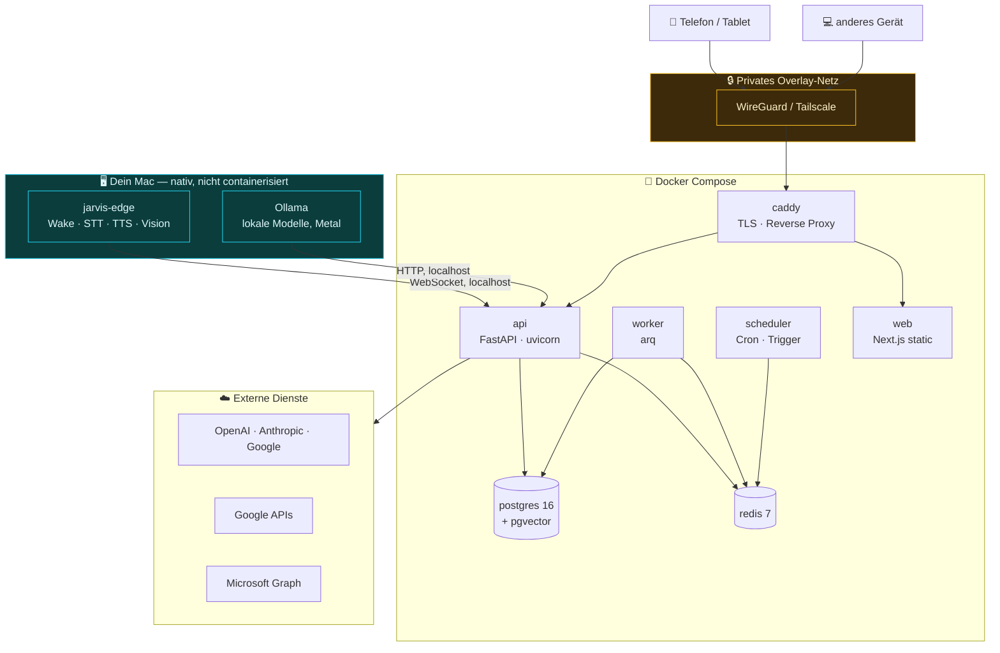

# Deployment- und Betriebsarchitektur

---

## 1. Topologie



**Warum diese Aufteilung:** Alles, was Gerätezugriff braucht (Mikrofon, Kamera, Metal-GPU), läuft nativ. Alles andere im Container. Das ist kein Kompromiss, sondern folgt der physischen Realität — Versuche, Audio- und GPU-Zugriff auf macOS in Container zu bringen, führen zu Konstruktionen, die bei jedem OS-Update brechen.

---

## 2. Entwicklungsumgebung

```yaml
# compose.yaml (Auszug)
services:
  postgres:
    image: pgvector/pgvector:pg16
    environment:
      POSTGRES_DB: jarvis
      POSTGRES_PASSWORD_FILE: /run/secrets/pg_password
    volumes: [pgdata:/var/lib/postgresql/data]
    healthcheck:
      test: ["CMD-SHELL", "pg_isready -U jarvis"]
      interval: 5s

  redis:
    image: redis:7-alpine
    command: redis-server --appendonly yes --requirepass-file /run/secrets/redis_password
    volumes: [redisdata:/data]

  api:
    build: { context: ., dockerfile: apps/api/Dockerfile }
    depends_on:
      postgres: { condition: service_healthy }
      redis:    { condition: service_started }
    environment:
      DATABASE_URL: postgresql+asyncpg://jarvis@postgres/jarvis
      REDIS_URL: redis://redis:6379/0
      OLLAMA_URL: http://host.docker.internal:11434
      KEY_PROVIDER: file                    # dev: Datei, prod: vault/kms
    ports: ["8000:8000"]
    develop:
      watch:
        - { action: sync, path: ./packages, target: /app/packages }
        - { action: rebuild, path: ./packages/*/pyproject.toml }

  worker:
    build: { context: ., dockerfile: apps/worker/Dockerfile }
    deploy: { replicas: 2 }

  scheduler:
    build: { context: ., dockerfile: apps/scheduler/Dockerfile }
```

Der Edge Daemon läuft daneben nativ:

```bash
uv run --package jarvis-edge jarvis-edge --api ws://localhost:8000/v1/stream
```

`make dev` startet beides und wartet auf Health-Checks.

---

## 3. Produktivbetrieb

Zwei realistische Varianten:

| Variante | Wann sinnvoll | Aufbau |
|---|---|---|
| **A — Alles lokal** (empfohlen zum Start) | Ein Mac, der ohnehin läuft | Compose auf demselben Rechner, Zugriff von außen nur über Overlay-Netz |
| **B — Server + Edge** | Mac schläft, Assistent soll durchlaufen | Kern auf einem kleinen Server (Hetzner o. ä.) oder Homeserver; Edge weiter auf dem Mac |

Variante B hat eine wichtige Konsequenz: Ohne laufenden Mac gibt es kein lokales Modell für P3-Daten. Dann muss entweder auf dem Server ebenfalls Ollama laufen (dann braucht der Server GPU oder akzeptiert langsame CPU-Inferenz) oder P3-Anfragen sind ohne den Mac nicht bedienbar. Das ist eine bewusste Entscheidung, die vor dem Umzug getroffen werden sollte.

**Unterschiede zur Entwicklung:**

| Aspekt | Produktion |
|---|---|
| Secrets | `KEY_PROVIDER=vault` oder `keychain` statt Datei |
| TLS | Caddy mit echten Zertifikaten oder Overlay-interne Zertifikate |
| Logs | strukturiert (JSON), Rotation, Redaktion aktiv |
| Backups | siehe §5 |
| Autostart | launchd (macOS) für Edge + Compose; systemd auf Linux |
| Debug | aus; keine Stacktraces in API-Antworten |

---

## 4. Observability

| Signal | Werkzeug | Zweck |
|---|---|---|
| **Traces** | OpenTelemetry → Jaeger oder Grafana Tempo | Vollständiger Pfad Mikrofon → Antwort mit Zeitanteilen je Stufe |
| **Metriken** | Prometheus (via OTel) | Latenz-Perzentile, Kosten, Fehlerquoten, Cache-Trefferquote |
| **Logs** | structlog → JSON, mit `trace_id` korreliert | Fehleranalyse |
| **Health** | `/v1/system/status`, gespeist aus `system_health` | Systemanzeige in der UI |

**Kennzahlen, die tatsächlich beobachtet werden sollten:**

| Metrik | Zielwert | Warum |
|---|---|---|
| `voice.end_to_end_ms` (p95) | < 1500 ms | Über diesem Wert wird Sprachbedienung aufgegeben |
| `llm.ttft_ms` je Provider (p95) | < 800 ms | Dominanter Anteil am Sprachbudget |
| `run.cost_eur` (Tagessumme) | < konfiguriertes Budget | Kostenkontrolle |
| `policy.confirm_rate` | 5–15 % der Tool-Aufrufe | Zu hoch → Bestätigungsmüdigkeit; zu niedrig → zu lax |
| `wakeword.false_positive_per_day` | < 2 | Vertrauen ins Mikrofon |
| `stt.wer` (Stichprobe) | < 8 % | Qualität der Spracherkennung |
| `memory.candidate_accept_rate` | 40–70 % | Zu niedrig → Extraktion zu aggressiv |
| `provider.failover_count` | beobachten | Zeigt instabile Anbieter |

`policy.confirm_rate` ist die interessanteste Zahl im System: Sie misst, ob das Sicherheitsmodell im Alltag noch funktioniert oder bereits zur Klickgewohnheit geworden ist.

---

## 5. Backup und Wiederherstellung

| Daten | Verfahren | Frequenz | Aufbewahrung |
|---|---|---|---|
| PostgreSQL | `pg_dump` (custom format), verschlüsselt mit `age` | täglich | 30 Tage + 12 Monatsstände |
| WAL | Kontinuierliche Archivierung (Point-in-Time-Recovery) | laufend | 7 Tage |
| Object Store (Dokumente) | `restic` inkrementell, verschlüsselt | täglich | 30 Tage |
| Secrets / KEK | **Separat**, offline, nicht im selben Backup | bei Änderung | dauerhaft |
| Redis | kein Backup nötig (Cache + Queue) | — | — |

**Der KEK gehört nicht ins Datenbank-Backup.** Läge er dort, wäre die Verschlüsselung aus ADR-008 wirkungslos — ein gestohlenes Backup enthielte Daten *und* Schlüssel. Er wird getrennt gesichert (Passwortmanager, Papier, Hardware-Token).

**Wiederherstellung wird geübt**, nicht angenommen: Ein vierteljährlicher Testlauf stellt in eine leere Umgebung wieder her und prüft, ob OAuth-Tokens entschlüsselbar sind. Ein Backup, dessen Wiederherstellung nie getestet wurde, ist eine Vermutung.

---

## 6. Betriebsgrenzen und Kosten

Grobe Schätzung für intensive Einzelnutzung (60–120 Interaktionen täglich, Stand 2026, Größenordnung):

| Posten | Monatlich |
|---|---|
| Cloud-LLM (bei ~60 % lokal geroutet) | 25–60 € |
| STT | 0 € (lokal) |
| TTS (ElevenLabs, ~30 min/Tag) | 15–25 € |
| Websuche-API | 5–10 € |
| Server (Variante B) | 15–40 € |
| **Summe** | **~60–135 €** |

Die größte Stellschraube ist der Anteil lokal verarbeiteter Anfragen. Klassifikation, Extraktion, Zusammenfassung und Verdichtung machen mengenmäßig den Großteil aller Modellaufrufe aus — sie laufen alle lokal und kosten nichts. Das ist ein zusätzlicher Grund für die Architekturentscheidung aus ADR-010, jenseits des Datenschutzes.

---

## 7. Betriebsverfahren

| Aufgabe | Verfahren |
|---|---|
| Migration | Alembic; `make migrate`; Rollback-Skript vor jedem Deploy geprüft |
| Deploy | `git pull && make build && docker compose up -d`; Health-Check-Gate |
| Provider-Ausfall | Automatischer Failover; Meldung in der UI; kein manueller Eingriff nötig |
| Token abgelaufen | Nutzerbenachrichtigung mit Direktlink zur Neuverbindung |
| Schlüsselrotation | `scripts/rotate_keys.py` — nur `wrapped_dek` neu verpackt, keine Ausfallzeit |
| Modellwechsel | Konfiguration; neue Embeddings parallel aufbauen, dann umschalten |
| Notaus | `make panic` — stoppt alle Läufe, deaktiviert alle nicht-lesenden Scopes, schließt Kamera und Mikrofon |

Der letzte Punkt ist bewusst vorgesehen: Ein Assistent mit Handlungsfähigkeit braucht einen einzelnen, schnell erreichbaren Schalter, der ihn ohne Diskussion stilllegt.
