# Entwicklungsplan: MVP bis zur ersten vollständigen Plattformversion

Aufwandsangaben in **Wochen für eine erfahrene Person in Vollzeit**. Bei Teilzeit entsprechend skalieren. Die Schätzungen sind ehrlich gemeint, nicht optimistisch — Integrationen mit OAuth und Fremdsystemen kosten regelmäßig mehr Zeit als erwartet.

---

## Übersicht

```mermaid
gantt
    dateFormat X
    axisFormat %s
    title Phasen (Wochen, kumuliert)
    section Kern
    P1 Fundament + Chat           :p1, 0, 5
    P2 Sprache                    :p2, after p1, 4
    P3 Produktivität              :p3, after p2, 6
    P4 Gedächtnis + RAG           :p4, after p3, 4
    section Ausbau
    P5 JARVIS-UI                  :p5, after p4, 4
    P6 Vision + Gesten            :p6, after p5, 3
    P7 Agenten                    :p7, after p6, 4
    P8 Erweiterungen              :p8, after p7, 6
```

**Nach Phase 4 (≈19 Wochen) ist das System täglich nutzbar.** Alles danach erhöht Komfort und Reichweite, nicht die Grundtauglichkeit.

**Zur Formulierung „nach 36 Wochen fertig":** Die gibt es nicht. Phase 8 markiert die **erste vollständige Plattformversion** — den Punkt, ab dem alle Architekturbausteine stehen und neue Fähigkeiten additiv hinzukommen, ohne Umbau. Ein System dieser Art ist danach nicht abgeschlossen, sondern in kontinuierlicher Weiterentwicklung. Ein Enddatum zu suggerieren erzeugt die falsche Erwartung und den falschen Umgang mit dem Backlog.

---

## Phase 1 — Fundament und Chat (5 Wochen)

**Ziel:** Ein funktionierender, typsicherer Textassistent mit Berechtigungssystem — das Skelett, auf dem alles Weitere aufsetzt.

| Woche | Inhalt |
|---|---|
| 1 | Monorepo, `uv`/pnpm-Workspaces, Docker Compose, CI, `contracts/`-Paket, Datenbankschema + Alembic |
| 2 | Auth (Passkey + Session), `LLMProvider`-Protokoll + OpenAI-Adapter, Basis-REST |
| 3 | Orchestrator: Klassifikation, Router, Direct-Modus, Streaming über WebSocket |
| 4 | Tool Registry, Policy Engine, `pending_actions`, Audit-Log mit Hash-Kette |
| 5 | Web-UI: Chat, Statusleiste, Bestätigungsdialog, Permission Center (Grundfassung) |

**Abnahmekriterien:**
- Textdialog mit Streaming funktioniert Ende-zu-Ende.
- Ein Tool mit `risk=HIGH` (Testwerkzeug) löst zuverlässig einen Bestätigungsdialog aus; Ablehnung verhindert die Ausführung.
- `make gen` erzeugt TS-Typen; CI schlägt bei Drift fehl.
- Audit-Log-Kette verifiziert korrekt; Manipulation wird erkannt.
- Testabdeckung `core/` ≥ 70 %.

**Größtes Risiko:** Zu früh Features bauen, bevor Policy Engine und Contracts stehen. Diese beiden nachträglich einzuziehen ist teurer als sie zuerst zu bauen.

---

## Phase 2 — Sprache (4 Wochen)

**Ziel:** „Jarvis, wie spät ist es?" funktioniert unter 1,2 Sekunden.

| Woche | Inhalt |
|---|---|
| 6 | Edge Daemon: Audio-Aufnahme, Silero VAD, WebSocket-Protokoll |
| 7 | openWakeWord inkl. zweistufiger Verifikation, faster-whisper streaming, Ringpuffer |
| 8 | `TTSProvider` (ElevenLabs + Piper), satzweise Synthese, Wiedergabe |
| 9 | AEC, Barge-in, Regel-Abkürzungen, Latenzmessung und -optimierung |

**Abnahmekriterien:**
- p95 Ende-zu-Ende unter 1,5 s für einfache Fragen.
- Barge-in unterbricht zuverlässig, ohne Selbstauslösung durch Echo.
- Weniger als 2 Fehlauslösungen pro Tag im Normalbetrieb.
- Kein Roh-Audio persistiert (durch Test verifiziert).

**Größtes Risiko:** AEC. Das ist erfahrungsgemäß der zeitaufwendigste Einzelpunkt der Phase — großzügig planen oder zunächst Kopfhörerbetrieb voraussetzen.

---

## Phase 3 — Produktivität (6 Wochen)

**Ziel:** Mail und Kalender real nutzbar — der Punkt, ab dem das System Arbeit abnimmt statt nur zu antworten.

| Woche | Inhalt |
|---|---|
| 10 | OAuth-Flows (Google + Microsoft), Envelope Encryption, Token-Refresh, Kontoverwaltung |
| 11–12 | `MailProvider`: Gmail + Graph. Lesen, Suchen, Threads, Entwürfe, Senden mit Bestätigung |
| 13–14 | `CalendarProvider`: Google + Graph. Lesen, Erstellen, Verschieben, Löschen, Free/Busy-Suche |
| 15 | Aufgaben, Erinnerungen, Automationen, Scheduler; erste proaktive Regeln |

**Abnahmekriterien:**
- „Fasse meine ungelesenen Mails zusammen" liefert brauchbare Priorisierung.
- „Plane mir morgen zwei Stunden konzentrierte Arbeitszeit" findet ein sinnvolles Fenster.
- **Taint-Tracking nachgewiesen:** Eine Test-Mail mit eingebetteter Anweisung kann keinen Versand auslösen.
- Token-Refresh läuft ohne Nutzereingriff; abgelaufene Zugänge werden gemeldet.

**Größtes Risiko:** Microsoft Graph ist deutlich sperriger als die Google-APIs (Berechtigungsmodell, Consent, Tenant-Besonderheiten). Falls die Zeit knapp wird: Gmail und Google Calendar zuerst vollständig, Microsoft in Phase 3b nachziehen.

---

## Phase 4 — Gedächtnis und RAG (4 Wochen)

**Ziel:** JARVIS kennt dich und deine Dokumente.

| Woche | Inhalt |
|---|---|
| 16 | Memory-Schema, Embeddings (Cloud + lokal), Hybrid-Retrieval, Scoring-Kalibrierung |
| 17 | Extraktionspipeline, Kandidaten-Queue, Dedup, Konfliktbehandlung |
| 18 | Dokument-Ingestion: PDF/DOCX/Mail, strukturbewusstes Chunking, Reranking, Quellenbelege |
| 19 | Context Engine mit allen Providern, Budgetierung, Referenzauflösung, Memory-UI |

**Abnahmekriterien:**
- „Woher weißt du das?" liefert die konkrete Quelle.
- Dokumentfragen werden mit Seiten-/Abschnittsbeleg beantwortet.
- Retrieval-Eval-Suite: Recall@5 ≥ 0,85 auf dem Goldset.
- Löschung einer Erinnerung entfernt zuverlässig auch Embeddings; Retrieval liefert sie nicht mehr.
- „Schreib ihm …" löst die Referenz korrekt auf oder fragt nach.

---

### ▲ Ab hier ist das System produktiv nutzbar. Alles Weitere ist Ausbau.

---

## Phase 5 — JARVIS-Oberfläche (4 Wochen)

| Woche | Inhalt |
|---|---|
| 20 | Design-Tokens, Layout-Grundgerüst, Panels (Kalender, Mail, Tasks, Status) |
| 21 | AI Core: Shader, Zustandsmaschine, Übergänge |
| 22 | Echtzeit-Visualisierung: Audiopegel, Ausgabewellenform, Planfortschritt |
| 23 | Aktivitätsprotokoll, Systemstatus, Feinschliff, Barrierefreiheit, Fallback-Modus |

**Abnahmekriterien:** 60 fps bei aktivem Core; `prefers-reduced-motion` wird respektiert; Kontrastanforderungen erfüllt; vollständige Tastaturbedienung.

---

## Phase 6 — Vision und Gesten (3 Wochen)

| Woche | Inhalt |
|---|---|
| 24 | Kamera-Pipeline, MediaPipe, Privacy Gate mit Kill-Switch |
| 25 | Merkmalsextraktion, Klassifikator, Trainingsdaten für 5 Gesten |
| 26 | Gesten-Registry, Entprellung, Kontextbindung, Screenshot-Pfad mit Maskierung |

**Abnahmekriterien:** Gestenerkennung ≥ 95 % Trefferquote bei ≤ 1 Fehlauslösung pro Stunde; Kill-Switch gibt das Kameragerät nachweislich frei; kein Frame verlässt das Gerät.

---

## Phase 7 — Agenten (4 Wochen)

| Woche | Inhalt |
|---|---|
| 27 | Agent Runtime, Supervisor, Handoff-Protokoll, Least-Privilege-Filterung, Budgetaufteilung |
| 28 | Research Agent inkl. Websuche, Quellenvergleich, Zitatpflicht |
| 29 | Mail-, Calendar-, Document-Agent als eigenständige Spezialisten |
| 30 | Coding Agent, Planned-/Delegated-Modus, Verifikationsstufe |

**Abnahmekriterien:** „Vergleiche Laptops unter 2.000 €" liefert eine belegte Entscheidungshilfe mit prüfbaren Quellen; Sub-Agenten können nachweislich nicht auf Tools außerhalb ihrer Whitelist zugreifen; Budgetüberschreitung beendet sauber mit Teilergebnis.

---

## Phase 8 — Erweiterungen (6 Wochen)

| Woche | Inhalt |
|---|---|
| 31–32 | Plugin-System: MCP-Host, Manifest, Freigabedialog, Isolation |
| 33 | Home Assistant, Wetter, Standort |
| 34 | Mobile Client (PWA oder React Native) |
| 35 | Proaktive Assistenz: vollständiger Regelsatz, Ruhezeiten, Push |
| 36 | Computersteuerung — **nur mit Screenshot-Vorschau und Freigabe pro Aktion** |

---

## Reihenfolgeprinzipien

1. **Verträge vor Implementierung.** Jede Phase beginnt mit den Pydantic-Modellen der neuen Grenzen.
2. **Sicherheit gleichzeitig, nicht danach.** Kein Tool ohne Scope und Risikoklasse — auch nicht „vorläufig".
3. **Jede Phase endet lauffähig.** Kein Zustand, in dem das System zwei Wochen lang nicht startet.
4. **Nach jeder Phase zwei Wochen tatsächliche Nutzung** vor Beginn der nächsten. Was in Phase 3 stört, sollte Phase 4 beeinflussen.
5. **Evals wachsen mit.** Jede Phase erweitert die Eval-Suite um ihre Kernfälle (`15-testing.md`).

---

## Wenn die Zeit knapp wird

Streichreihenfolge, wenn der Umfang reduziert werden muss — von unwichtig nach unverzichtbar:

1. Gestensteuerung (Phase 6) — höchster Aufwand, geringster Alltagsnutzen
2. Computersteuerung (Phase 8) — höchstes Risiko
3. Mobile Client — eine PWA der bestehenden UI genügt zunächst
4. Microsoft-Integration — falls Google ausreicht
5. Coding Agent — dafür gibt es bessere spezialisierte Werkzeuge
6. Multi-Provider — mit zwei Anbietern statt vier starten

**Nicht streichbar, unter keinen Umständen:** Policy Engine, Taint-Tracking, Envelope Encryption, Audit-Log. Diese vier nachträglich einzuziehen bedeutet, das System neu zu bauen — und ohne sie ist ein Assistent mit Postfachzugriff ein Sicherheitsproblem, kein Werkzeug.
