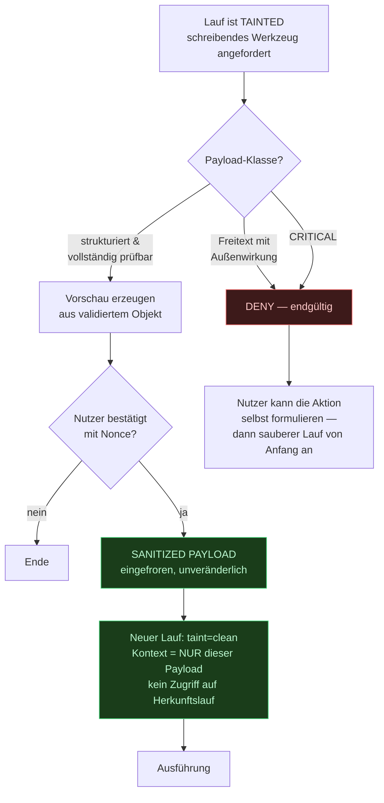

# Architektur-Review V1.1 — Bewertung und Beschlüsse

> Grundlage: zwei unabhängige externe Reviews des Dossiers V1.0.
> Dieses Dokument hält fest, **was übernommen wird und was nicht** — jeweils
> mit Begründung. Abgelehnte Punkte sind so wichtig wie übernommene: Sie
> verhindern, dass spätere Diskussionen dieselben Wege noch einmal gehen.

---

## Beschlusstabelle

| # | Vorschlag | Beschluss | Auswirkung |
|---|---|---|---|
| 1 | Taint blockiert schreibende Werkzeuge nach Fremdinhalt | **Übernommen, verschärft** | Doc 07 §4a, Doc 00 §6 |
| 2 | Identity & Preference Engine | **Übernommen** | Doc 17, Schema, Contracts |
| 3 | Goals / Projects / Objectives | **Übernommen** | Doc 17, Schema |
| 4 | Entitäten-Verknüpfung statt Vektorrauschen | **Übernommen, andere Umsetzung** | Doc 05 §9, Schema |
| 5 | Conversation Interrupt Controller | **Teilweise übernommen** | Doc 08 §7a, Events |
| 6 | Trust Ladder | **Teilweise übernommen** | Doc 07 §2a |
| 7 | KEK nie im API-Prozess | **Übernommen** | ADR-008 |
| 8 | Typisierter Run-State | **Übernommen** | Contracts |
| 9 | UI Command Center / Orbit | **Übernommen, Phase 5** | Doc 10 |
| 10 | „36 Wochen bis fertig" umformulieren | **Übernommen** | Doc 14 |
| 11 | Human Approval Gateway | **Bereits vorhanden** | — |
| 12 | MCP-Sandboxing | **Bereits vorhanden, verschärft** | Doc 12 §4 |
| 13 | Voice-Latenz / spekulativer Executor | **Bereits vorhanden** | — |
| 14 | „Personal OS" als Laufzeitschicht | **Abgelehnt als Schicht, übernommen als Gliederung** | Doc 00 |

---

## 1 — Taint-Clearing: der schwerwiegendste Befund

### Der Widerspruch

Doc 00 §6 zeigte den Ablauf *„Mails prüfen → Termin anlegen"* als erfolgreich.
Doc 07 §4 und `ToolSpec.is_blocked_by_taint()` sperren `calendar.create` nach
dem Lesen von Fremdinhalt jedoch unbedingt. **Beides zugleich kann nicht
stimmen** — und der gesperrte Fall ist der häufigste Alltagsablauf überhaupt.

Ein Sicherheitsmechanismus, der den Normalfall blockiert, wird abgeschaltet.
Dann ist er wirkungslos. Das ist keine Randnotiz, sondern ein Konstruktions-
fehler.

### Warum die naheliegende Lösung nicht reicht

Der Vorschlag lautete: Bei bestätigtem Payload einen neuen, sauberen Lauf
starten. Der Mechanismus ist richtig — die Bedingung ist zu weit gefasst.

Die Bestätigung ist nur dann eine echte Sicherheitsprüfung, wenn der Mensch
den Payload **vollständig erfassen** kann. Bei einem Kalendereintrag
(„14:00–15:00, Angebot Projekt X") ist das in zwei Sekunden der Fall. Bei
einem E-Mail-Body mit 2.000 Wörtern nicht: Eine um eine Ziffer veränderte
IBAN oder eine ausgetauschte URL im Fließtext übersieht auch ein aufmerksamer
Leser. Genau darauf zielen reale Angriffe.

### Beschluss: Taint-Sanitization-Gate mit Payload-Klassifikation

**Payload-Klassifikation** — neues Feld `ToolSpec.payload_inspectability`:

| Wert | Bedeutung | Taint-Clearing |
|---|---|---|
| `structured` | Alle Felder sind kurze, typisierte Werte (Datum, Zeit, ID, Titel ≤ 200 Zeichen) | ✅ zulässig |
| `freeform` | Enthält mindestens ein Freitextfeld mit Außenwirkung | ❌ nie |
| `opaque` | Payload nicht sinnvoll darstellbar (Binärdaten, Skripte) | ❌ nie |

Beispiele: `calendar.create` → `structured`. `tasks.create` → `structured`.
`send_email` → `freeform`. `shell.exec` → `opaque`.

### Vier Invarianten des sanierten Laufs

1. **Payload eingefroren.** Was bestätigt wurde, wird ausgeführt — byte-identisch.
   Der neue Lauf kann den Payload nicht verändern.
2. **Keine Kontextvererbung.** Der saubere Lauf sieht den Herkunftslauf nicht,
   auch nicht dessen Zusammenfassung. Sonst wäre der Injection-Pfad wieder offen.
3. **Genau ein Werkzeugaufruf.** Der sanierte Lauf führt eine Aktion aus und
   endet. Er plant nicht, er delegiert nicht.
4. **Beide Läufe im Audit verknüpft.** `sanitized_from_run_id` macht die
   Herkunft nachvollziehbar — sonst entstünde eine Aktion ohne Vorgeschichte.

Ohne Invariante 2 und 3 wäre das Gate eine Umgehung des Taint-Schutzes statt
seiner Ergänzung.

---

## 2 — Identity & Preference Engine

**Berechtigt.** V1.0 hatte Präferenzen nur als untypisiertes
`users.preferences`-JSONB und „Kernpräferenzen immer geladen". Das trägt
nicht: Ohne typisiertes Schema kann weder die UI sie sinnvoll anzeigen noch
der Orchestrator sie verlässlich auswerten.

Das ist der Unterschied zwischen einem sicheren Agentensystem und einem
persönlichen Assistenten. Details in Doc 17.

**Wichtige Nebenbedingung, die im Vorschlag fehlte:** Präferenzen kosten
Kontextbudget bei *jedem* Turn. Im Sprachpfad stehen dafür 4.000 Token
insgesamt zur Verfügung. Deshalb wird zwischen **Kernprofil** (immer geladen,
harte Obergrenze 400 Token) und **abrufbaren Präferenzen** (per Retrieval bei
Bedarf) unterschieden. Ohne diese Trennung frisst die neue Schicht das
Latenzbudget aus Doc 08 §6 auf.

---

## 3 + 4 — Ziele, Projekte und Entitäten

**Berechtigt, aber die vorgeschlagene Umsetzung wird nicht übernommen.**

### Zum Graph-RAG-Vorschlag

Die Beispielanfrage *„Was habe ich letzte Woche mit Thomas besprochen?"* ist
kein Vektorproblem, sondern ein **Filterproblem**: Zeitraum + Entität. Ein
Knowledge Graph mit openCypher (Apache AGE) bringt dafür eine zweite
Abfragesprache und eine Extension mit deutlich geringerer Betriebsreife als
der Postgres-Kern — für etwas, das ein Join löst.

### Was stattdessen kommt

Eine relationale Entitätenschicht: `entities` + `entity_links` + `relations`.

Der entscheidende Punkt ist nicht die Technik, sondern dass **eine Abstraktion
drei unabhängige Anforderungen bedient**:

| Anforderung | Woher | Wie bedient |
|---|---|---|
| Referenzauflösung („schreib *ihm*") | Doc 05 §6, V1.0 | Salienzliste = Entitäten mit Zeitstempel |
| Ziele und Projekte | Review B1-2 | Ziel ist eine Entität mit Typ `goal` |
| Präzises Entity-Retrieval statt Vektorrauschen | Review B2-3 | Join statt Ähnlichkeitssuche |

Wenn eine Struktur drei getrennt entstandene Anforderungen erfüllt, ist sie
richtig geschnitten. Ein zusätzlicher Graph-Layer wäre eine vierte Antwort auf
dieselbe Frage.

Ziele erhalten zusätzlich: `horizon` (Tag/Woche/Quartal/Jahr), `status`,
`milestones`, `constraints` — damit „Wie weit bin ich mit meinem Business?"
beantwortbar wird, ohne dass ein Modell das aus Gesprächsverläufen raten muss.

---

## 5 — Interrupt Controller

**Teilweise übernommen.**

Bereits in V1.0 vorhanden (Doc 08 §7, Doc 11 §3): Barge-in mit AEC,
`tts.stop`, `user.interrupt`, Laufzustand `interrupted`.

**Echte Lücke:** V1.0 kennt nur *Abbruch*. Der Fall

> „Suche mir die besten Laptops unter 2.000 —"
> „Nein, stopp. Ich meinte unter 1.000 Euro."

ist keine Unterbrechung, sondern eine **Korrektur**. Ein Abbruch mit
anschließendem Neustart verwirft alle bereits gefundenen Zwischenergebnisse
und kostet die volle Latenz erneut.

Neu: `InterruptKind` mit `cancel` | `pause` | `resume` | `correct`. Bei
`correct` bleiben abgeschlossene Planschritte erhalten; nur die von der
geänderten Randbedingung betroffenen Schritte werden neu geplant. Der
Orchestrator hat mit `Plan.depends_on` bereits die Information, welche das
sind — die Fähigkeit war da, nur der Auslöser fehlte.

---

## 6 — Trust Ladder

**Teilweise übernommen.** Von den sechs vorgeschlagenen Stufen existieren vier
bereits als `RiskLevel` × `PermissionMode`; Stufe 5 („niemals autonom") ist als
Abwesenheit von Implementierung sogar strenger umgesetzt (Doc 07 §11).

**Echte Lücke:** Stufe 2 — *einmalige Bestätigung, die zur Regel wird*. Genau
das adressiert Risiko R5 (Bestätigungsmüdigkeit), das V1.0 zwar benennt, aber
nur mit `undo` beantwortet.

Neu: Der Bestätigungsdialog bietet neben „Bestätigen" ein
**„Immer erlauben für …"** an, das eine `ScopeConstraints`-Regel schreibt —
etwa `recipients_allowlist += [thomas@kunde.de]`. Die Regel ist im Permission
Center sichtbar und widerrufbar.

Wichtig: Das Angebot erscheint **nicht** bei `CRITICAL` und nicht in
kontaminierten Läufen. Sonst ließe sich per Injection eine dauerhafte
Berechtigung erschleichen.

---

## 7 — KEK außerhalb des API-Prozesses

**Übernommen.** ADR-008 nannte bereits Vault und Keychain als Backends, ließ
aber offen, wo der entpackte Schlüssel liegt. Der Einwand ist berechtigt: Bei
`KEY_PROVIDER=file` liegt der KEK im Speicher desselben Prozesses, der HTTP
annimmt — eine Schwachstelle im Web-Layer gibt damit alle Tokens preis.

Verschärfung: In Produktion **entpackt der API-Prozess nie selbst**. Er sendet
den `wrapped_dek` an eine Entpack-Instanz (Vault Transit oder ein lokaler
Unix-Socket-Dienst mit eigener Benutzerkennung) und erhält den DEK zurück. Der
KEK verlässt diese Instanz nie. `KEY_PROVIDER=file` bleibt ausschließlich für
Entwicklung zulässig und wird beim Start in Produktion abgelehnt.

---

## 11–13 — Bereits vorhanden

| Punkt | Fundstelle in V1.0 |
|---|---|
| **Human Approval Gateway** | Doc 07 §5 (vier Regeln), Doc 10 §7 (Dialog), und bereits **implementiert**: `ActionPreview`/`PreviewField` mit Validator, der `CONFIRM` ohne Vorschau ablehnt |
| **MCP-Sandboxing** | Doc 12 §2 und §4 (eigener Prozess, keine geteilten Objekte, kein DB-/FS-Zugriff, Hostbeschränkung) |
| **Spekulativer Voice-Executor** | Doc 08 §6 („Spekulativer Start … bevor der Nutzer ausgesprochen hat") |
| **Barge-in über WebSocket** | Doc 08 §7, Doc 11 §3 (`tts.stop`, `user.interrupt`) |

**Eine Verschärfung bei den Plugins übernehme ich dennoch:** Die
In-Process-Stufe für „eigene, geprüfte Plugins" (Doc 07 §9, Stufe 2) entfällt.
Sie war eine pragmatische Ausnahme, die die strukturelle Zusicherung aufweicht
— ein Fehler im eigenen Plugin hätte Vollzugriff bedeutet. Alle Plugins laufen
als eigener Prozess.

### Zur Aussage „bei 1,2 Sekunden bricht die Sprach-UX zusammen"

Dem widerspreche ich sachlich. 1,2 s Ende-zu-Ende ist für eine
Pipeline-Architektur ein guter Wert und liegt im Bereich verbreiteter
Sprachassistenten. Unterhalb von ~700 ms wäre ein Speech-to-Speech-Modell
nötig — was in Doc 08 §1 bewusst verworfen wurde, weil es Provider-Bindung
erzwingt und Roh-Audio in die Cloud sendet. Diese Abwägung bleibt bestehen.

---

## 14 — „Personal Operating System"

**Als Laufzeitschicht abgelehnt, als Gliederung übernommen.**

Die vorgeschlagene Dreiteilung — Knowledge / Actions / Context — beschreibt
exakt die bestehenden Komponenten Memory Service / Tools + Agenten / Context
Engine. Eine zusätzliche Ebene im Diagramm, die keine eigene Verantwortung
trägt, keine eigene Schnittstelle hat und keine Entscheidung fällt, macht das
System nicht mächtiger. Sie macht das Diagramm größer.

Als **Ordnungsrahmen für die Dokumentation** ist die Dreiteilung hilfreich und
wird in Doc 00 übernommen.

Denselben Maßstab lege ich an den „Mission Planner" an: Eine Mission, die in
einen Lauf passt, *ist* ein `Plan` mit `PlanStep` und `depends_on` — das
existiert seit V1.0. Neu und tatsächlich fehlend ist die **mehrsitzungs-
übergreifende, langfristige Zielverfolgung** — und die ist bereits Punkt 3
(Goals). Zwei Namen für dieselbe Lücke ergeben keine zwei Bausteine.

---

## Abgrenzung: was jetzt gebaut wird und was nicht

Zehn Erweiterungen vor Implementierungsbeginn sind genau der Mechanismus,
gegen den die Phasenaufteilung in Doc 14 konstruiert wurde. Deshalb die harte
Trennung:

**Jetzt (ändert Verträge oder Schema — später teuer):**

- Taint-Sanitization-Gate (Policy-Vertrag, `ToolSpec.payload_inspectability`)
- Entitäten, Ziele, Projekte (Migration)
- Identity/Preference typisiert (Contracts + Migration)
- Interrupt mit Korrektursemantik (Events)
- Typisierter Run-State
- ADR-008-Verschärfung

**Später (rein additiv, kein Umbau nötig):**

- UI Command Center mit Orbit → Phase 5
- Proaktivitätsstufen bis „autonomous-within-policy" → Phase 8; benötigt keinen
  neuen Mechanismus, `automations.allowed_scopes` trägt das bereits
- Doku-Gliederung nach Knowledge/Actions/Context

Da Block 1 zwar committet, aber nichts produktiv im Einsatz ist, ist jetzt der
günstigste Zeitpunkt für Schemaänderungen. Der Aufwand liegt bei etwa einem
Arbeitstag — es ist keine Neuarchitektur, weil alle Erweiterungen an
bestehende Verträge andocken statt sie zu ersetzen.

---

## Auswirkung auf die Roadmap

Doc 14 wird an einer Stelle umformuliert: „≈36 Wochen bis zur Vollausbaustufe"
→ **„≈36 Wochen bis zur ersten vollständigen Plattformversion"**, danach
kontinuierliche Weiterentwicklung. Der Einwand ist berechtigt: Ein System
dieser Art ist nie fertig, und ein Enddatum zu suggerieren erzeugt die falsche
Erwartung.

Die Phasenlängen ändern sich nicht. Die Erweiterungen aus diesem Dokument
verteilen sich auf bestehende Phasen:

| Erweiterung | Phase |
|---|---|
| Verträge, Schema, ADR-Verschärfung | 1 (jetzt, vorgezogen) |
| Taint-Gate, Trust-Ladder-Regeln | 1, Block 4 |
| Identity/Preference produktiv | 4 |
| Ziele, Projekte, Entitäten produktiv | 4 |
| Interrupt mit Korrektur | 2 |
| Command Center / Orbit | 5 |
