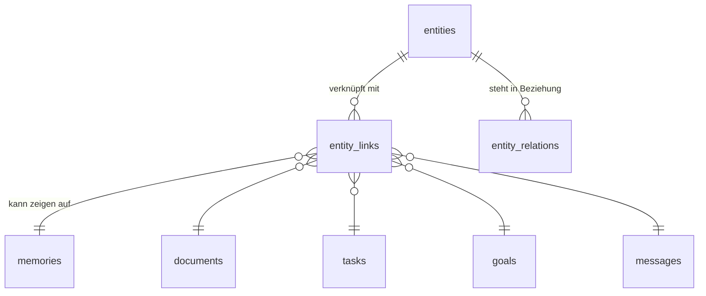

# Identity, Präferenzen, Ziele und Entitäten

> Neu in V1.1. Grundlage: Beschlüsse 2, 3 und 4 in `16-v1.1-review.md`.

Diese Schicht ist der Unterschied zwischen einem sicheren Agentensystem und
einem persönlichen Assistenten. V1.0 wusste, *was gefragt wurde*. Sie beantwortet
zusätzlich: **Wer bin ich für diesen Menschen, und woran arbeitet er gerade?**

---

## 1. Drei getrennte Fragen

| Frage | Zuständig | Lebensdauer |
|---|---|---|
| Wie soll ich mich verhalten? | **Identity & Preferences** | stabil, ändert sich selten |
| Was weiß ich über den Nutzer? | Memory (V1.0, Doc 05) | wächst kontinuierlich |
| Woran arbeitet er gerade? | **Goals & Projects** | mittelfristig, hat einen Zustand |

V1.0 warf alle drei in `memories`. Das funktioniert für Fakten, aber nicht für
Präferenzen (die bei *jedem* Turn gelten müssen, nicht bei passendem
Retrieval-Treffer) und nicht für Ziele (die einen Fortschritt haben).

---

## 2. Identity & Preference Engine

### Kernprofil — immer geladen, hart budgetiert

```python
class CoreProfile(BaseModel):
    """Bei JEDEM Turn im Prompt. Harte Obergrenze: 400 Token."""

    address_as: str  # "Mirek"
    formality: Literal["du", "sie"]
    language: str  # "de"
    response_length: Literal["knapp", "normal", "ausführlich"]
    working_hours: TimeWindow | None
    timezone: str
    proactivity: Literal["aus", "dezent", "normal", "aktiv"]
    hard_rules: list[str]  # max. 5, je max. 120 Zeichen
```

**Die Token-Obergrenze ist nicht kosmetisch.** Im Sprachpfad stehen laut
Doc 08 §6 insgesamt 4.000 Kontext-Token zur Verfügung, und die Prompt-Länge
geht direkt in die Zeit bis zum ersten Token ein. Eine Präferenzschicht ohne
Budget frisst genau das Latenzbudget auf, das die Sprachbedienung benutzbar
macht. `hard_rules` ist deshalb auf fünf Einträge begrenzt — wer zwanzig
Regeln hat, hat keine Regeln.

### Abrufbare Präferenzen — per Retrieval bei Bedarf

Alles Domänenspezifische wird nur geladen, wenn die Domäne im Spiel ist:

| Domäne | Beispiele |
|---|---|
| `mail` | Standardabsender, Signatur, Anrede je Kontakt, Antwortstil |
| `calendar` | Standardkalender, Pufferzeiten, bevorzugte Meetingzeiten, Fokusblöcke |
| `research` | bevorzugte Quellen, gesperrte Domains, Zitierpflicht |
| `voice` | Stimme, Sprechgeschwindigkeit, Aktivierungsmodus |
| `models` | bevorzugtes Modell je Aufgabenart |

```python
class DomainPreference(BaseModel):
    domain: str
    key: str
    value: JsonValue
    source: SourceType  # ausdrücklich gesetzt vs. abgeleitet
    confidence: float
    updated_at: datetime
```

### Do / Don't-Regeln

```python
class BehaviourRule(BaseModel):
    kind: Literal["do", "dont"]
    rule: str = Field(max_length=200)
    scope: str | None = None  # None = global, sonst z. B. "mail"
    priority: int = Field(ge=1, le=5)
    source: SourceType
```

**Wichtige Grenze:** `BehaviourRule` steuert *Stil und Verhalten*, niemals
*Berechtigungen*. „Frag nicht jedes Mal nach" ist eine Stilregel und darf keine
Policy-Entscheidung verändern. Wer weniger Bestätigungen will, ändert das im
Permission Center — dort ist die Änderung sichtbar, auditiert und widerrufbar.

Ohne diese Trennung wäre eine per Prompt Injection eingeschleuste
„Verhaltensregel" ein Weg zur Rechteerweiterung.

---

## 3. Ziele und Projekte

### Warum nicht als Memory-Eintrag

„Ich möchte dieses Jahr mein Cybersecurity-Business aufbauen" ist strukturell
etwas anderes als „Ich trinke Kaffee schwarz":

- Es hat einen **Zustand** (aktiv, pausiert, erreicht, verworfen).
- Es hat einen **Zeithorizont**.
- Es hat **Fortschritt**, der sich aus Aktionen ableitet.
- Es hat **Randbedingungen** („nebenberuflich", „ohne Fremdkapital").
- Andere Objekte **verweisen darauf** — Aufgaben, Termine, Dokumente.

Ein Retrieval-Treffer beantwortet „Wie weit bin ich?" nicht. Eine Tabelle schon.

```python
class Goal(BaseModel):
    id: UUID
    title: str
    description: str | None
    horizon: Literal["tag", "woche", "monat", "quartal", "jahr", "offen"]
    status: Literal["aktiv", "pausiert", "erreicht", "verworfen"]
    priority: int = Field(ge=1, le=5)
    parent_id: UUID | None  # Ziel-Hierarchie
    constraints: list[str]  # "nebenberuflich", "ohne Fremdkapital"
    target_date: date | None
    progress_note: str | None  # zuletzt festgestellter Stand
    data_class: DataClass = DataClass.P2
```

Projekte sind Ziele mit `horizon` ≤ Quartal und laufender Arbeit; Meilensteine
sind Ziele mit `parent_id`. Eine eigene Tabelle je Ebene bringt keinen Gewinn
— die Hierarchie trägt die Unterscheidung.

### Fortschritt wird nicht geraten

JARVIS leitet Fortschritt **nicht** aus Gesprächsverläufen ab. Er ergibt sich
aus verknüpften Objekten: erledigte Aufgaben, gehaltene Termine, erstellte
Dokumente. Was sich nicht belegen lässt, wird als offen ausgewiesen — nicht
optimistisch geschätzt. Ein Assistent, der Fortschritt erfindet, ist
schlimmer als einer, der keinen ausweist.

---

## 4. Entitätenschicht

### Beschluss statt Knowledge Graph

Die Beispielanfrage *„Was habe ich letzte Woche mit Thomas besprochen?"* ist
ein Filterproblem (Zeitraum + Entität), kein Ähnlichkeitsproblem. Sie wird mit
einem Join gelöst, nicht mit Vektorsuche und auch nicht mit openCypher
(Begründung in `16-v1.1-review.md §3+4`).



```python
class Entity(BaseModel):
    id: UUID
    kind: Literal["person", "organisation", "projekt", "ort", "goal", "thema"]
    canonical_name: str
    aliases: list[str]  # "Thomas", "Thomas M.", "Herr Müller"
    gender: Literal["m", "f", "n", "unknown"]  # trägt die Referenzauflösung
    attributes: dict[str, JsonValue]  # Rolle, E-Mail, Beziehung
    data_class: DataClass = DataClass.P2
    last_mentioned_at: datetime | None
    mention_count: int
```

### Eine Struktur, drei Anforderungen

| Anforderung | Herkunft | Umsetzung über Entitäten |
|---|---|---|
| Referenzauflösung („schreib *ihm*") | V1.0, Doc 05 §6 | Salienz = `last_mentioned_at` + `mention_count`; `gender` filtert Kandidaten |
| Ziele und Projekte | Review B1-2 | Ziel ist eine Entität mit `kind="goal"` |
| Präzises Retrieval ohne Vektorrauschen | Review B2-3 | `entity_links` + Zeitfilter statt Ähnlichkeitssuche |

Dass drei getrennt entstandene Anforderungen dieselbe Struktur brauchen, ist
das stärkste Argument für ihren Zuschnitt. Ein zusätzlicher Graph-Layer wäre
eine vierte Antwort auf dieselbe Frage.

### Auflösung mehrdeutiger Namen

`aliases` löst „Thomas" auf — aber wenn es zwei Thomas gibt, wird gefragt
(Doc 05 §6). Neu ist, dass die Frage **einmalig** ist: Die Antwort schreibt
einen Alias auf die richtige Entität. Beim nächsten Mal ist „Thomas"
eindeutig, solange kein zweiter hinzukommt.

---

## 5. Zusammenspiel mit der Context Engine

Drei neue Context-Provider, alle mit `cost="db"` und damit im Sprachpfad
zulässig:

| Provider | Priorität | Budget | Inhalt |
|---|---|---|---|
| `core_profile` | `PINNED` | 400 | Kernprofil, nie verdrängt |
| `active_goals` | `STRUCTURED` | 600 | aktive Ziele, nach Priorität |
| `salient_entities` | `CONVERSATION` | 400 | Entitäten der laufenden Sitzung |
| `domain_prefs` | `RETRIEVAL` | 400 | nur bei erkannter Domäne |

Die Verdrängungsreihenfolge aus Doc 05 §5 bleibt unverändert gültig; die neuen
Provider ordnen sich ein. `core_profile` ist der einzige neue Eintrag auf
Stufe `PINNED` — alles andere ist verdrängbar, damit das Sprachbudget hält.

---

## 6. Datenschutz

Ziele und Entitäten sind sensibel: Sie beschreiben Lebensplanung und soziale
Beziehungen. Standardklassifikation ist deshalb **P2**, mit ausdrücklicher
Höherstufung auf P3 pro Eintrag (Gesundheitsziele, Finanzziele).

Alle Objekte dieser Schicht:

- erscheinen im Permission Center unter „Gedächtnis", einzeln einsehbar,
  bearbeitbar und löschbar,
- tragen Provenienz wie Memory-Einträge,
- werden bei `DELETE /v1/me/data` kaskadierend mitgelöscht,
- unterliegen dem privaten Modus (keine Extraktion, keine Aktualisierung).
